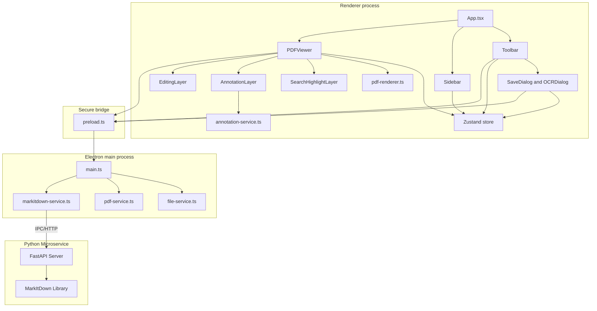
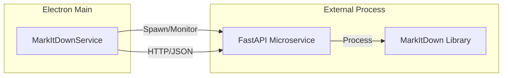
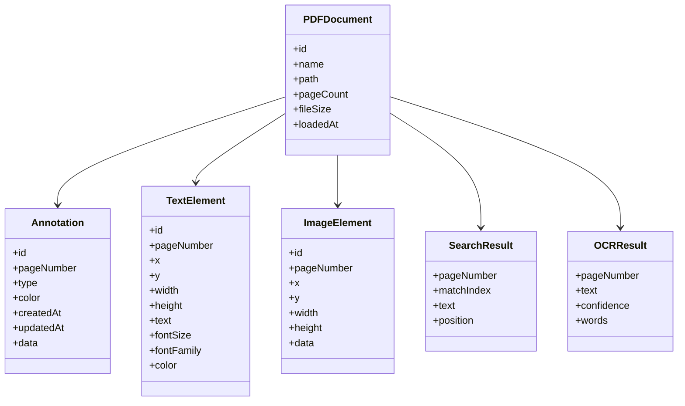
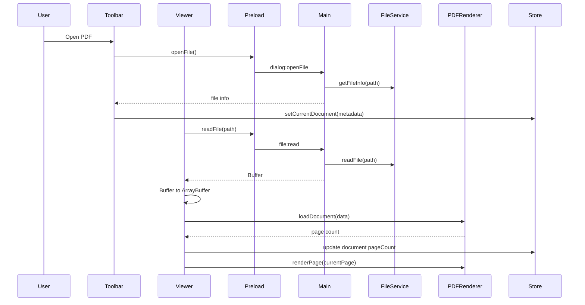
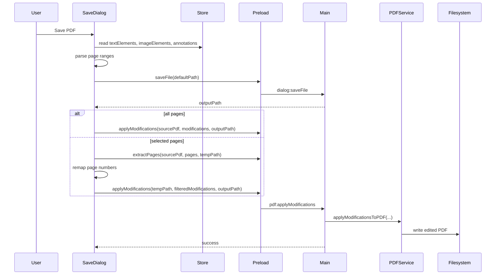
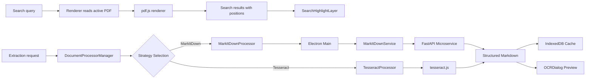
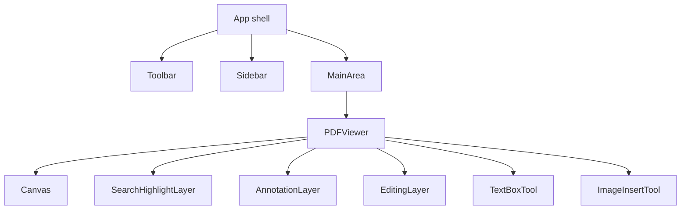
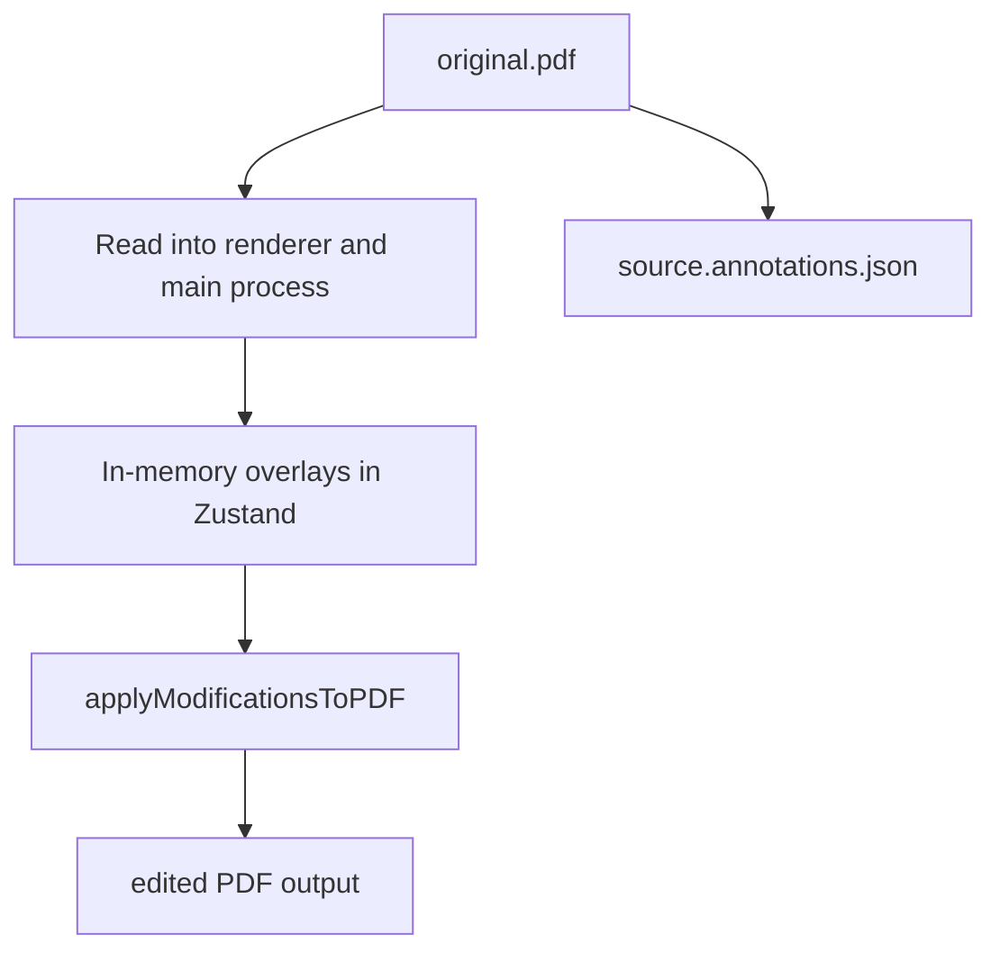

# Architecture

This document consolidates the project-level setup notes, fix summaries, and architecture sketches into one technical reference tied to the current codebase.

## Runtime Topology

## Phase 1 Architecture Evolution (In Progress)

To support multi-format document processing and decouple OCR from the renderer, the architecture is evolving towards a microservice-based model.

### Microservice Integration

A Python-based FastAPI microservice wrapping **Microsoft MarkItDown** is being integrated. This service is managed as a subprocess by the Electron Main process.

### Strategy Pattern for Document Processing

A new abstraction layer is being implemented to allow pluggable document processors.

- `DocumentProcessor`: Interface defining `process(file: string): Promise<string>`.
- `MarkItDownProcessor`: Primary processor using the microservice.
- `TesseractProcessor`: Fallback processor for local PDF/Image OCR.
- `DocumentProcessorManager`: Orchestrates processor selection and fallback logic.

## Key Responsibilities

### Renderer

- `App.tsx` sets up the shell, dark-mode initialization, and empty-state handling.
- `Toolbar.tsx` owns top-level commands such as open, save, zoom, search, OCR, and theme switching.
- `Sidebar.tsx` switches between thumbnails, annotations, and search.
- `PDFViewer.tsx` loads the active document, renders the current page, and composes overlay layers.
- `usePDFStore.ts` is the single shared state container for document data, UI state, overlays, search, and OCR results.

### Main process

- `main.ts` creates the Electron window and registers IPC handlers.
- `file-service.ts` handles file metadata plus raw read and write operations.
- `pdf-service.ts` performs PDF mutations with `pdf-lib`, including merge, split, delete, extract, rotate, text insertion, image insertion, and the consolidated save path that applies in-memory modifications.

## Core Data Model

State is stored primarily as page-keyed `Map<number, T[]>` collections in [src/renderer/store/usePDFStore.ts](src/renderer/store/usePDFStore.ts), which keeps overlays and OCR results aligned to the active page without introducing separate caches per component.

## Document Lifecycle

Two implementation details matter here because they were the source of several older fix notes:

- The renderer converts the Electron `Buffer` into an `ArrayBuffer` before passing it to `pdfjs-dist`.
- `PDFViewer.tsx` gates page rendering on `isDocumentReady` to avoid rendering before document load completes.

## Save Pipeline

`applyModificationsToPDF()` is the effective export path. It walks every page and applies:

- text overlays as drawn text
- image overlays as embedded PNG or JPEG assets
- supported annotations as PDF drawing operations

This is why the current docs should describe save as an export step, not a simple file copy.

## Search And Extraction (Phase 1)

Search remains fully renderer-side and relies on `pdf-renderer.ts` text extraction from `pdfjs-dist`. Extraction (formerly OCR) is being migrated to a Strategy-based model. The `MarkItDownProcessor` is the primary engine, offloading heavy processing to a Python microservice via the `MarkItDownService` in the main process. `TesseractProcessor` remains as a fallback for local-only OCR of images or when the microservice is unavailable.

## UI Composition

Overlay order in the viewer is:

1. rendered PDF canvas
2. search highlights
3. annotations
4. text and image overlays

That ordering keeps transient highlights visible without obscuring inserted content.

## Files And Persistence

Persistence currently happens in two forms:

- exported PDFs written through `pdf-service.ts`
- sidecar annotation JSON written through `annotations:save`

The sidecar annotation save and the embedded PDF export are separate mechanisms.

## Boundaries And Known Gaps

- `PageManagement.tsx` is not wired into the main workflow, so merge, split, delete, and extract should be treated as partial UI work rather than a polished feature surface.
- `exportPageToImage()` and `extractText()` in [src/main/services/pdf-service.ts](src/main/services/pdf-service.ts) intentionally throw and need additional dependencies before they can be documented as shipped features.
- The PDF.js worker path is CDN-based in [src/services/pdf-renderer.ts](src/services/pdf-renderer.ts), which is simple for development but not ideal for fully offline packaging.

## Testing Surface

- Unit tests cover the PDF renderer, annotation service, Zustand store, and toolbar UI.
- Playwright coverage is light and currently focuses on shell-level behavior rather than full document workflows.
- For changes near save, OCR, or viewer loading, manual verification still matters because those paths depend on Electron, canvas rendering, and local file dialogs.
