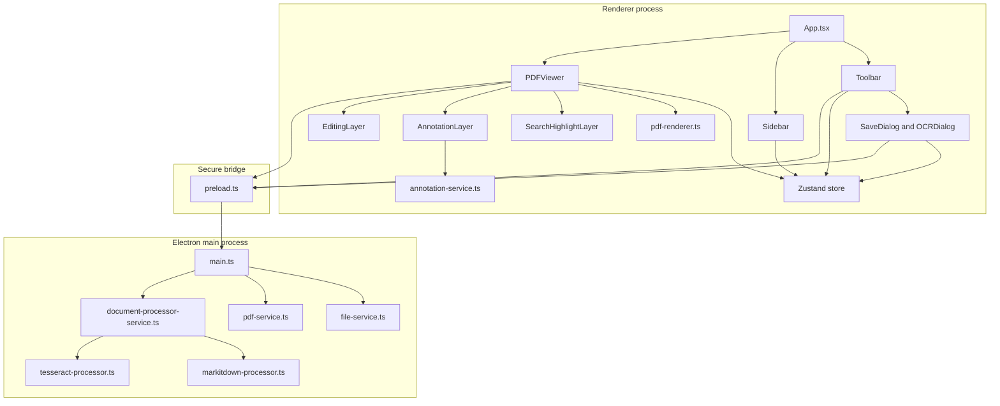
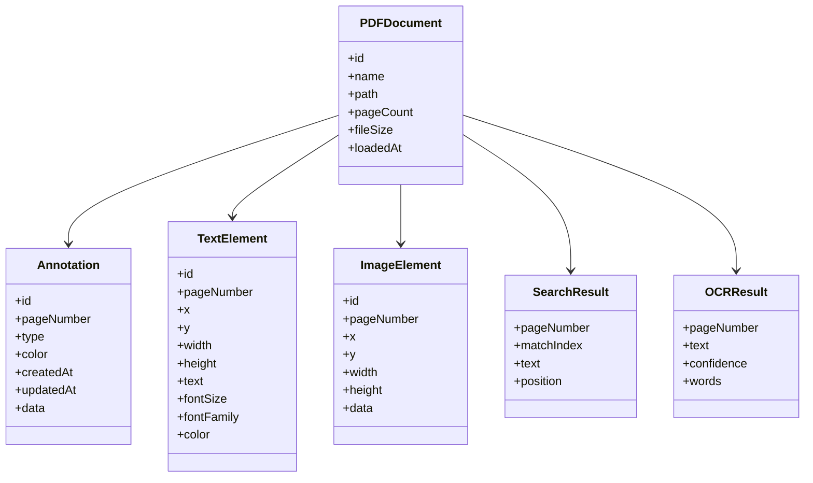
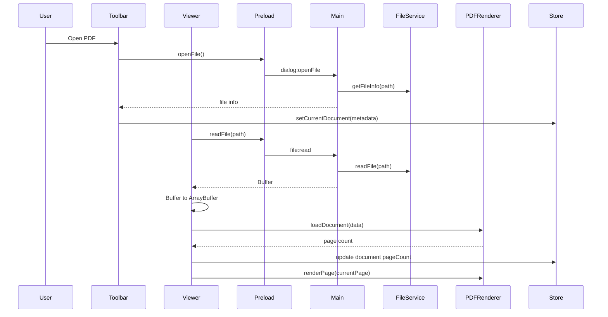
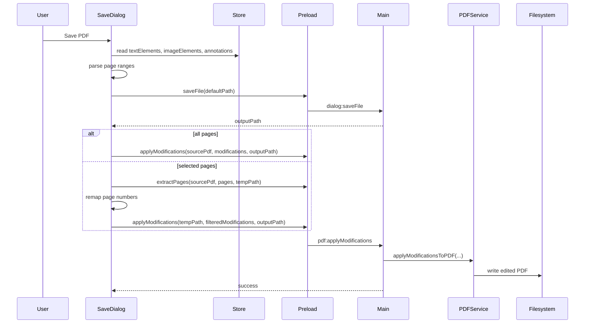
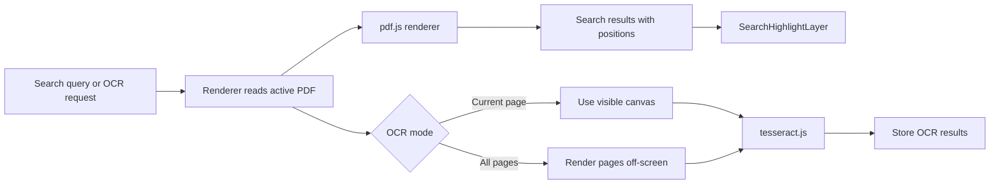
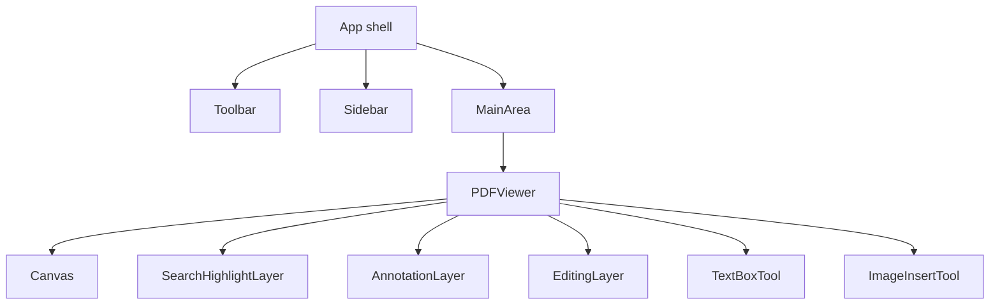
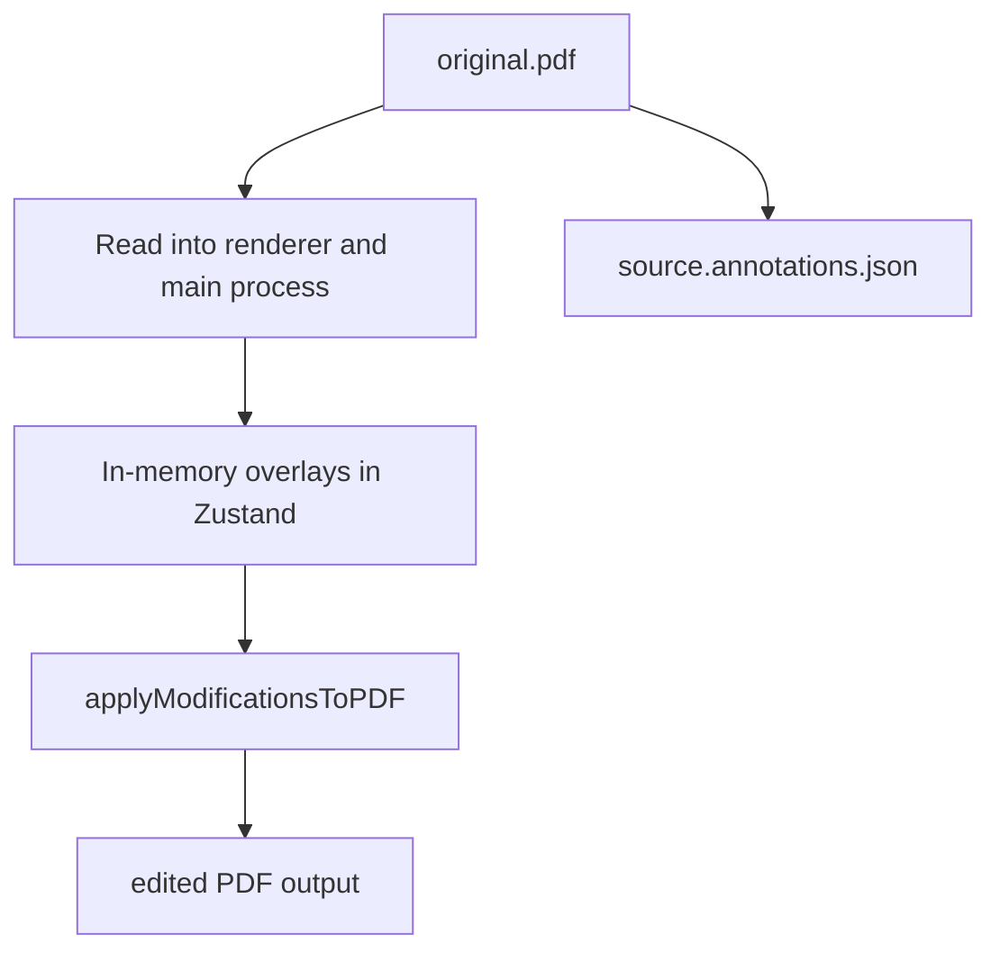
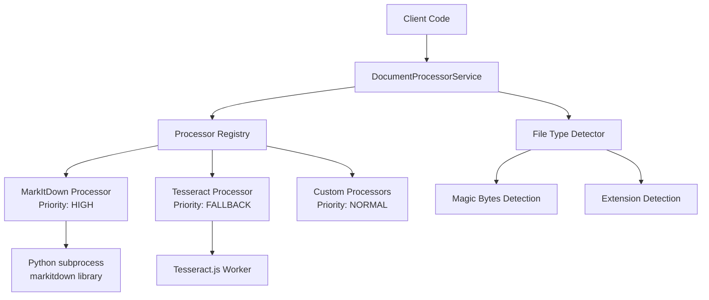

# Architecture

This document consolidates the project-level setup notes, fix summaries, and architecture sketches into one technical reference tied to the current codebase.

## Runtime Topology



## Key Responsibilities

### Renderer

- `App.tsx` sets up the shell, dark-mode initialization, and empty-state handling.
- `Toolbar.tsx` owns top-level commands such as open, save, zoom, search, OCR, and theme switching.
- `Sidebar.tsx` switches between thumbnails, annotations, and search.
- `PDFViewer.tsx` loads the active document, renders the current page, and composes overlay layers.
- `usePDFStore.ts` is the single shared state container for document data, UI state, overlays, search, and OCR results.

### Main process

- `main.ts` creates the Electron window and registers IPC handlers.
- `file-service.ts` handles file metadata plus raw read and write operations.
- `pdf-service.ts` performs PDF mutations with `pdf-lib`, including merge, split, delete, extract, rotate, text insertion, image insertion, and the consolidated save path that applies in-memory modifications.
- `document-processor-service.ts` orchestrates pluggable document processing backends using the Strategy Pattern, with automatic processor selection based on file type and availability.
- `markitdown-processor.ts` provides high-priority document processing using Python's MarkItDown library for comprehensive format support.
- `tesseract-processor.ts` provides fallback OCR-based processing using Tesseract.js for images and scanned documents.

## Core Data Model



State is stored primarily as page-keyed `Map<number, T[]>` collections in [src/renderer/store/usePDFStore.ts](/Users/supravojana/Documents/GitHub/portable-document-formatter/src/renderer/store/usePDFStore.ts), which keeps overlays and OCR results aligned to the active page without introducing separate caches per component.

## Document Lifecycle



Two implementation details matter here because they were the source of several older fix notes:

- The renderer converts the Electron `Buffer` into an `ArrayBuffer` before passing it to `pdfjs-dist`.
- `PDFViewer.tsx` gates page rendering on `isDocumentReady` to avoid rendering before document load completes.

## Save Pipeline



`applyModificationsToPDF()` is the effective export path. It walks every page and applies:

- text overlays as drawn text
- image overlays as embedded PNG or JPEG assets
- supported annotations as PDF drawing operations

This is why the current docs should describe save as an export step, not a simple file copy.

## Search And OCR



Search is fully renderer-side and relies on `pdf-renderer.ts` text extraction from `pdfjs-dist`. OCR is also currently renderer-driven from `OCRDialog.tsx`; the separate `ocr-service.ts` and `src/workers/ocr-worker.ts` are placeholders rather than the active path.

## UI Composition



Overlay order in the viewer is:

1. rendered PDF canvas
2. search highlights
3. annotations
4. text and image overlays

That ordering keeps transient highlights visible without obscuring inserted content.

## Files And Persistence



Persistence currently happens in two forms:

- exported PDFs written through `pdf-service.ts`
- sidecar annotation JSON written through `annotations:save`

The sidecar annotation save and the embedded PDF export are separate mechanisms.

## Boundaries And Known Gaps

- `PageManagement.tsx` is not wired into the main workflow, so merge, split, delete, and extract should be treated as partial UI work rather than a polished feature surface.
- `exportPageToImage()` and `extractText()` in [src/main/services/pdf-service.ts](/Users/supravojana/Documents/GitHub/portable-document-formatter/src/main/services/pdf-service.ts) intentionally throw and need additional dependencies before they can be documented as shipped features.
- The PDF.js worker path is CDN-based in [src/services/pdf-renderer.ts](/Users/supravojana/Documents/GitHub/portable-document-formatter/src/services/pdf-renderer.ts), which is simple for development but not ideal for fully offline packaging.

## Document Processor Abstraction Layer (Phase 1.2)

### Overview

The Document Processor Abstraction Layer implements the **Strategy Pattern** to provide pluggable document processing backends with automatic selection based on file type and processor availability.

### Architecture



### Key Components

1. **DocumentProcessor Interface** - Strategy interface that all processors implement:
   - `canProcess(fileType)` - Check if processor supports file type
   - `isAvailable()` - Verify processor dependencies are available
   - `process(filePath, options)` - Process document from file
   - `processBuffer(buffer, fileType, options)` - Process from memory buffer
   - `cleanup()` - Release resources

2. **DocumentProcessorService** - Context/Registry:
   - Maintains registry of available processors
   - Performs automatic file type detection
   - Selects highest-priority available processor
   - Caches availability checks (1 minute TTL)
   - Provides unified API for document processing

3. **File Type Detector**:
   - Magic byte signature detection (high confidence)
   - Extension-based fallback (medium confidence)
   - Supports PDF, Office documents, images, text formats

4. **Concrete Processors**:
   - **MarkItDownProcessor** (Priority: HIGH) - Python subprocess integration
   - **TesseractProcessor** (Priority: FALLBACK) - OCR-based processing

### Processor Selection Algorithm

```
1. Detect file type using magic bytes and extension
2. Find all processors where canProcess(fileType) == true
3. Sort processors by priority (descending)
4. For each processor in priority order:
   a. Check availability (with caching)
   b. If available, use this processor
   c. Otherwise, try next processor
5. If no processor available, throw error
```

### Usage Example

```typescript
// Register processors (at app startup)
documentProcessorService.registerProcessor(new MarkItDownProcessor());
documentProcessorService.registerProcessor(new TesseractProcessor());

// Process document (automatic selection)
const result = await documentProcessorService.processDocument('/path/to/doc.pdf');
// Uses MarkItDown if available, falls back to Tesseract if not

// Result structure:
// {
//   text: "extracted content...",
//   confidence: 95,
//   processorName: "MarkItDownProcessor",
//   processingTime: 234,
//   metadata: { pageCount: 5, author: "..." }
// }
```

### Supported File Types

| Type | Formats | MarkItDown | Tesseract |
|------|---------|------------|-----------|
| PDF | .pdf | ✓ | ✓ (OCR only) |
| Office | .docx, .xlsx, .pptx | ✓ | ✗ |
| Images | .png, .jpg, .gif, .bmp | ✓ | ✓ |
| Text | .txt, .md, .html, .csv | ✓ | ✗ |

### Error Handling

The system uses structured error handling via `DocumentProcessingError`:

```typescript
enum ProcessingErrorCode {
  UNSUPPORTED_FILE_TYPE,
  FILE_NOT_FOUND,
  FILE_CORRUPTED,
  PROCESSING_TIMEOUT,
  PROCESSOR_UNAVAILABLE,
  OCR_FAILED,
  UNKNOWN_ERROR
}
```

### Integration Points

- **Main Process**: Service runs in Electron main process for file system access
- **IPC Bridge**: Exposed via IPC handlers for renderer access
- **OCR Dialog**: Can leverage document processor for enhanced OCR
- **File Import**: Future integration for importing non-PDF formats

### Testing

Comprehensive test suite covers:
- Processor registration and lifecycle
- Priority-based selection and fallback
- Availability caching
- File type detection (magic bytes and extensions)
- Error handling and edge cases
- All 26 tests passing

### Future Enhancements

- **Phase 1.3**: Native PDF text extraction (pdf-lib integration)
- **Phase 1.4**: Direct Office parsing (no Python dependency)
- **Phase 1.5**: Worker pool for parallel processing
- **Phase 1.6**: Streaming API for large documents
- **Phase 1.7**: Progress reporting and cancellation

See [DOCUMENT_PROCESSOR_README.md](./DOCUMENT_PROCESSOR_README.md) for detailed documentation.

## Testing Surface

- Unit tests cover the PDF renderer, annotation service, Zustand store, toolbar UI, and document processor abstraction layer.
- Document processor tests verify processor selection, fallback behavior, file type detection, and error handling.
- Playwright coverage is light and currently focuses on shell-level behavior rather than full document workflows.
- For changes near save, OCR, or viewer loading, manual verification still matters because those paths depend on Electron, canvas rendering, and local file dialogs.
