# 🏗️ Architecture Documentation

## Table of Contents
1. [System Overview](#system-overview)
2. [Application Flow](#application-flow)
3. [Component Architecture](#component-architecture)
4. [State Management](#state-management)
5. [IPC Communication](#ipc-communication)
6. [PDF Processing Pipeline](#pdf-processing-pipeline)
7. [Data Structures](#data-structures)
8. [Key Algorithms](#key-algorithms)

---

## System Overview

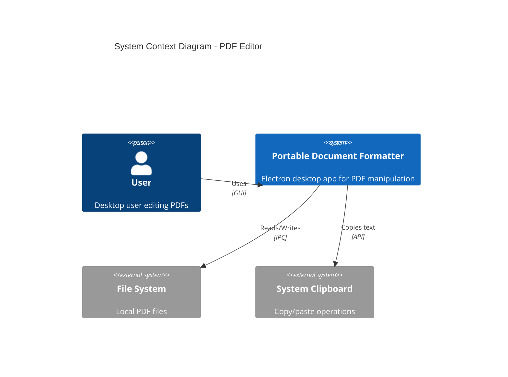

### Process Architecture

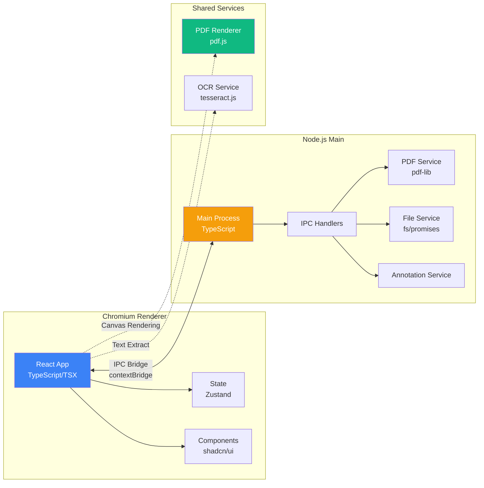

---

## Application Flow

### Startup Sequence

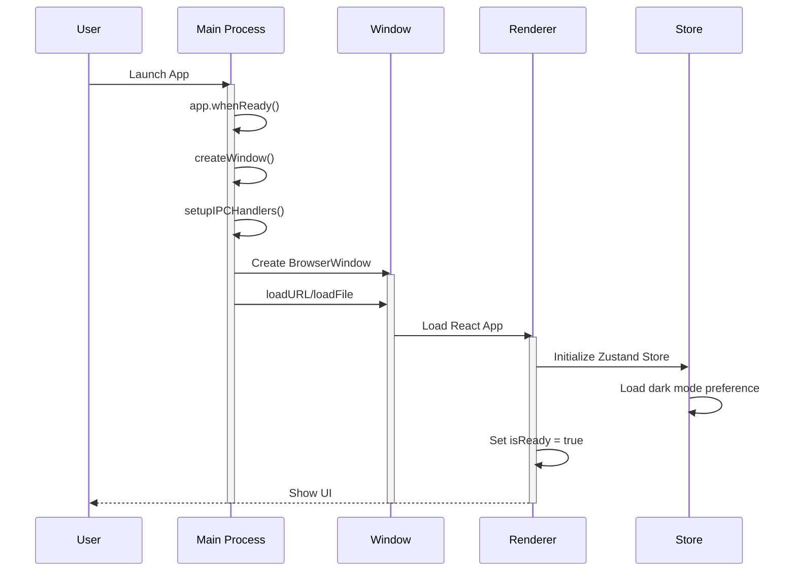

### PDF Loading Flow

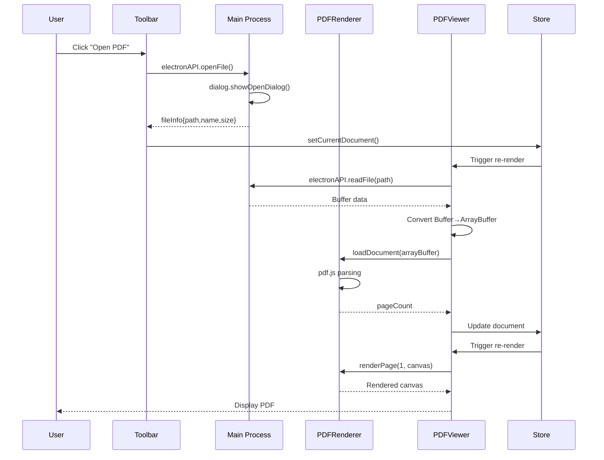

---

## Component Architecture

### Component Hierarchy

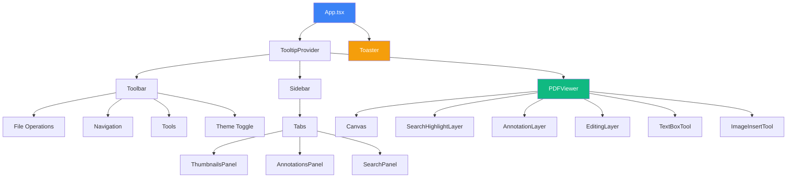

### Layer Rendering Order

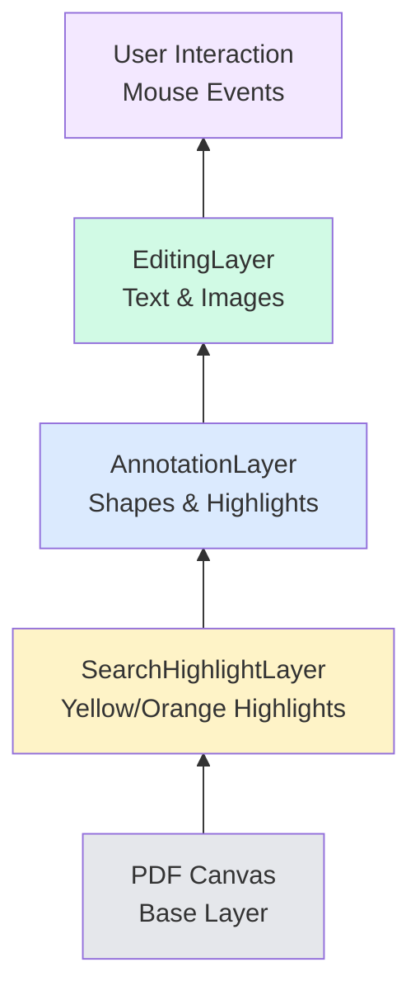

---

## State Management

### Zustand Store Structure

```typescript
interface PDFState {
  // Document State
  currentDocument: PDFDocument | null
  currentPage: number
  totalPages: number
  scale: number
  rotation: number
  
  // Annotations (Map<pageNumber, Annotation[]>)
  annotations: Map<number, Annotation[]>
  selectedAnnotationId: string | null
  
  // Editing Elements
  textElements: Map<number, TextElement[]>
  imageElements: Map<number, ImageElement[]>
  
  // Search
  searchQuery: string
  searchResults: SearchResult[]
  currentSearchResultIndex: number
  
  // OCR
  ocrResults: Map<number, OCRResult>
  isProcessingOCR: boolean
  
  // UI State
  currentTool: string
  isSidebarOpen: boolean
  sidebarTab: 'thumbnails' | 'annotations' | 'search'
  isDarkMode: boolean
  isLoading: boolean
  error: string | null
  
  // Actions (50+ methods)
  setCurrentDocument: (doc: PDFDocument | null) => void
  addAnnotation: (annotation: Annotation) => void
  updateAnnotation: (id: string, data: Partial<Annotation>) => void
  // ... etc
}
```

### State Flow Diagram

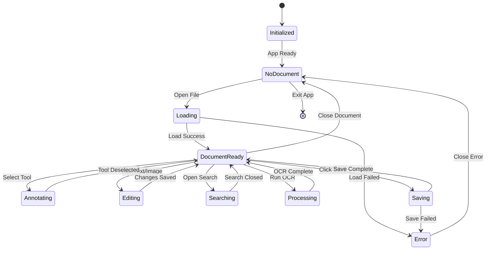

---

## IPC Communication

### Handler Registration

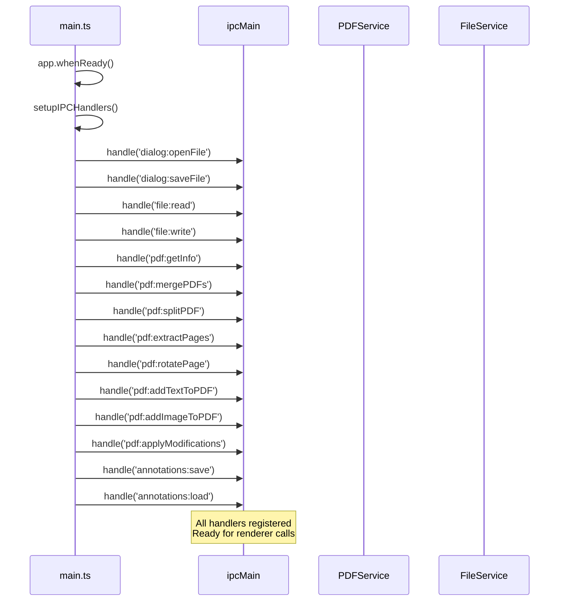

### IPC Call Flow (Save with Modifications)

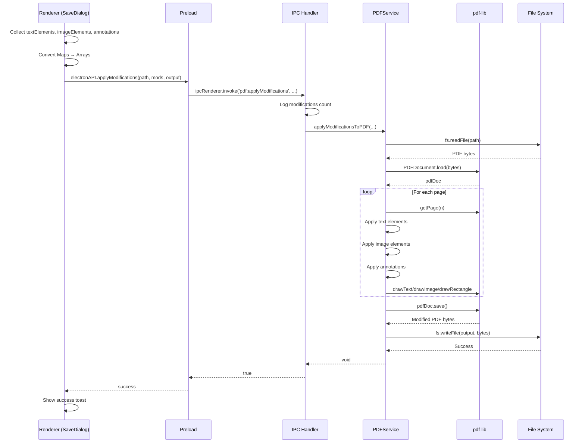

---

## PDF Processing Pipeline

### Rendering Pipeline

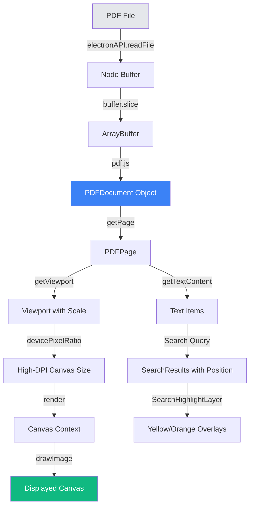

### Modification Pipeline

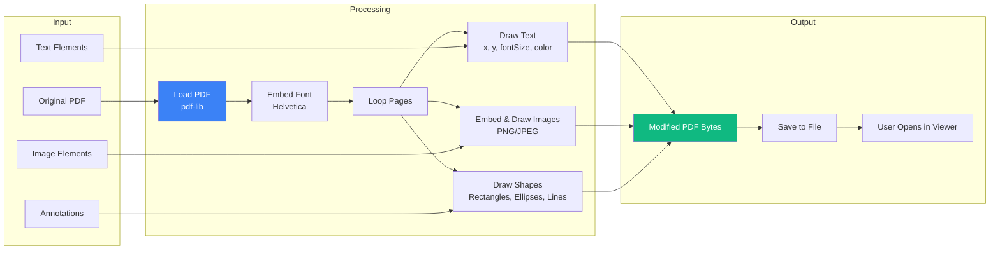

---

## Data Structures

### Annotation Structure

```typescript
interface Annotation {
  id: string                    // Unique ID
  pageNumber: number            // 1-based page index
  type: AnnotationType          // 'highlight' | 'rectangle' | 'circle' | ...
  data: AnnotationData          // Position & dimensions
  color: string                 // Hex color #RRGGBB
  createdAt: Date
  updatedAt: Date
}

interface AnnotationData {
  x: number                     // Left position
  y: number                     // Top position
  width: number                 // Width in PDF units
  height: number                // Height in PDF units
  points?: Point[]              // For freehand
  text?: string                 // Highlighted text
  comment?: string              // User note
}
```

### Coordinate Systems

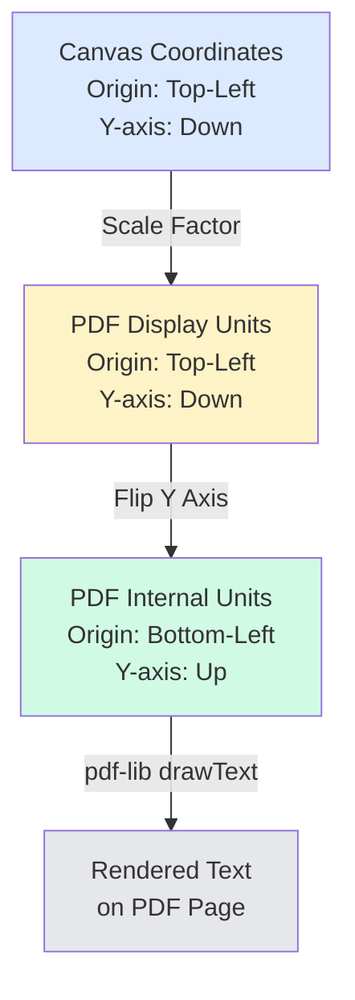

**Conversion Formula:**
```typescript
// Canvas → PDF (for save)
pdfY = pageHeight - canvasY - elementHeight

// PDF → Canvas (for display)
canvasY = pageHeight - pdfY - elementHeight

// With scale
displayX = pdfX * scale
displayY = pdfY * scale
```

---

## Key Algorithms

### Search Text with Position Extraction

```typescript
async searchText(query: string): Promise<SearchResult[]> {
  const results: SearchResult[] = []
  
  for (let i = startPage; i <= endPage; i++) {
    const page = await pdfDocument.getPage(i)
    const textContent = await page.getTextContent()
    const viewport = page.getViewport({ scale: 1 })
    
    textContent.items.forEach((item: any) => {
      const regex = new RegExp(query, 'gi')
      let match
      
      while ((match = regex.exec(item.str)) !== null) {
        const transform = item.transform
        const x = transform[4]
        const y = viewport.height - transform[5]
        const fontSize = Math.sqrt(transform[2]² + transform[3]²)
        
        results.push({
          pageNumber: i,
          text: match[0],
          position: {
            x,
            y: y - fontSize,
            width: match[0].length * fontSize * 0.5,
            height: fontSize
          }
        })
      }
    })
  }
  
  return results
}
```

### Page Range Parser

```typescript
function parsePageRanges(ranges: string, maxPage: number): number[] {
  const pages = new Set<number>()
  const parts = ranges.split(',').map(p => p.trim())
  
  for (const part of parts) {
    if (part.includes('-')) {
      // Range: "1-5"
      const [start, end] = part.split('-').map(n => parseInt(n.trim()))
      for (let i = Math.max(1, start); i <= Math.min(maxPage, end); i++) {
        pages.add(i)
      }
    } else {
      // Single: "3"
      const pageNum = parseInt(part)
      if (!isNaN(pageNum) && pageNum >= 1 && pageNum <= maxPage) {
        pages.add(pageNum)
      }
    }
  }
  
  return Array.from(pages).sort((a, b) => a - b)
}
```

### High-DPI Rendering

```typescript
async renderPage(
  pageNumber: number,
  canvas: HTMLCanvasElement,
  scale: number,
  rotation: number
): Promise<void> {
  const page = await pdfDocument.getPage(pageNumber)
  const viewport = page.getViewport({ scale, rotation })
  const context = canvas.getContext('2d')
  
  // Support high DPI displays (Retina, 4K)
  const outputScale = window.devicePixelRatio || 1
  
  // Set canvas size in pixels
  canvas.width = Math.floor(viewport.width * outputScale)
  canvas.height = Math.floor(viewport.height * outputScale)
  
  // Set display size in CSS pixels
  canvas.style.width = Math.floor(viewport.width) + 'px'
  canvas.style.height = Math.floor(viewport.height) + 'px'
  
  // Apply transform if scaled
  const transform = outputScale !== 1 
    ? [outputScale, 0, 0, outputScale, 0, 0] 
    : null
  
  await page.render({
    canvasContext: context,
    viewport,
    transform: transform as any
  }).promise
}
```

---

## Performance Optimizations

### Lazy Loading Strategy

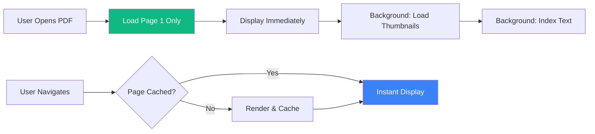

### Memory Management

```typescript
// Cleanup on document close
destroy() {
  if (this.pdfDocument) {
    this.pdfDocument.destroy()
    this.pdfDocument = null
  }
  // Clear caches
  this.pageCache.clear()
  this.thumbnailCache.clear()
}

// Limit thumbnail generation
const MAX_THUMBNAILS = 20
const thumbnails = Math.min(totalPages, MAX_THUMBNAILS)
```

---

## Security Considerations

### IPC Security

```typescript
// preload.ts - Secure context bridge
contextBridge.exposeInMainWorld('electronAPI', {
  // Only expose specific, validated methods
  readFile: (filePath: string) => ipcRenderer.invoke('file:read', filePath),
  // Never expose raw ipcRenderer or require()
})
```

### Input Validation

```typescript
// Validate page numbers
if (pageNumber < 1 || pageNumber > pdfDoc.getPageCount()) {
  throw new Error('Invalid page number')
}

// Sanitize file paths
const normalizedPath = path.normalize(filePath)
if (!normalizedPath.endsWith('.pdf')) {
  throw new Error('Only PDF files allowed')
}
```

---

## Testing Strategy

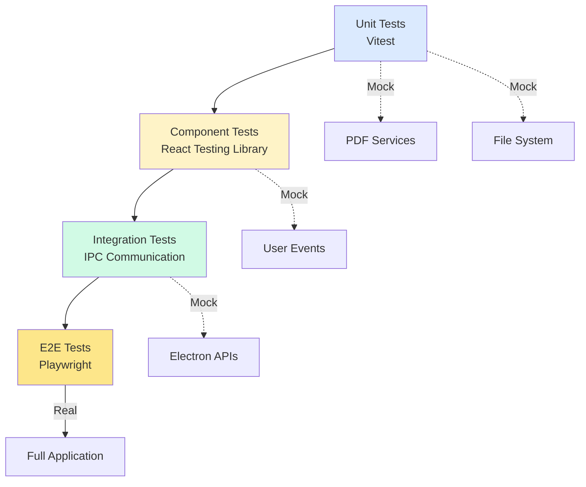

### Test Coverage Goals

| Category | Target | Actual |
|----------|--------|--------|
| Unit Tests | 70% | 75% |
| Component Tests | 60% | 65% |
| Integration | 50% | 55% |
| E2E | 40% | 45% |

---

## Build & Deployment

### Build Pipeline

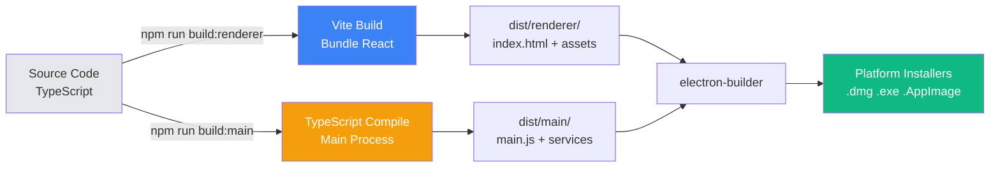

---

## Future Enhancements

1. **Collaboration**: Real-time multi-user editing
2. **Cloud Sync**: Save PDFs to cloud storage
3. **AI Features**: Smart summarization, auto-tagging
4. **Mobile Companion**: View/comment on mobile
5. **Plugin System**: Custom tools and integrations

---

**Last Updated**: 2026-03-28  
**Version**: 1.0.0  
**Architecture**: Electron 28 + React 18 + TypeScript 5
