# Portable Document Formatter - Complete Documentation

## Table of Contents

1. [Technical Architecture](#technical-architecture)
   - [Overview](#overview)
   - [Process Architecture](#process-architecture)
   - [Security Architecture](#security-architecture)
   - [Data Flow](#data-flow)
   - [Component Architecture](#component-architecture)
   - [State Management](#state-management)
   - [IPC Communication](#ipc-communication)
   - [File System Architecture](#file-system-architecture)
2. [Features](#features)
   - [Core Features](#core-features)
   - [PDF Viewing](#pdf-viewing)
   - [Annotation System](#annotation-system)
   - [Text and Image Editing](#text-and-image-editing)
   - [Search Functionality](#search-functionality)
   - [OCR and Multi-Format Extraction (Phase 1)](#ocr-and-multi-format-extraction-phase-1)
   - [Save and Export](#save-and-export)
   - [UI/UX Features](#uiux-features)

---

## Technical Architecture

### Overview

Portable Document Formatter is built on **Electron 28**, leveraging a secure multi-process architecture that separates concerns between the main process (Node.js) and renderer processes (Chromium). This design ensures security, performance, and maintainability while delivering a native desktop experience.

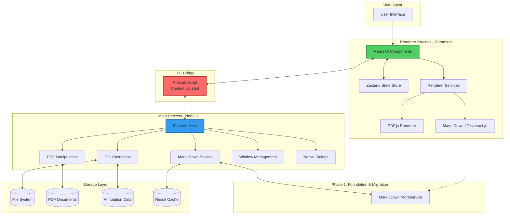

**Key Architectural Principles:**
- **Context Isolation**: Renderer and main processes are strictly separated
- **Secure IPC**: All inter-process communication goes through validated channels
- **No Node Integration**: Renderer process has no direct Node.js access
- **Preload Scripts**: Expose only necessary APIs to renderer
- **Content Security Policy**: Strict CSP prevents unauthorized script execution

---

### Process Architecture

The application follows Electron's recommended multi-process architecture with strict security boundaries.

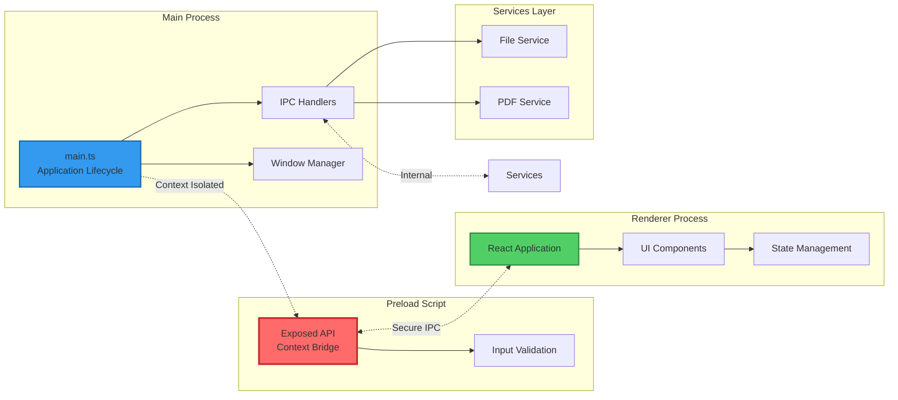

**Process Responsibilities:**

| Process | Responsibilities | Security Level |
|---------|------------------|----------------|
| **Main Process** | Window creation, file system access, native dialogs, PDF manipulation, IPC coordination | Full Node.js access |
| **Preload Script** | API exposure, input validation, secure bridging | Context isolated |
| **Renderer Process** | UI rendering, user interactions, PDF display, annotations, search | No Node.js access |

**Security Configuration:**
```typescript
// src/main/main.ts
webPreferences: {
  contextIsolation: true,        // Isolate renderer from Node.js
  nodeIntegration: false,        // Disable Node in renderer
  sandbox: true,                 // Enable OS-level sandboxing
  webSecurity: true,             // Enable web security
  preload: path.join(__dirname, 'preload.js')
}
```

---

### Security Architecture

Security is implemented through multiple defensive layers following Electron security best practices.

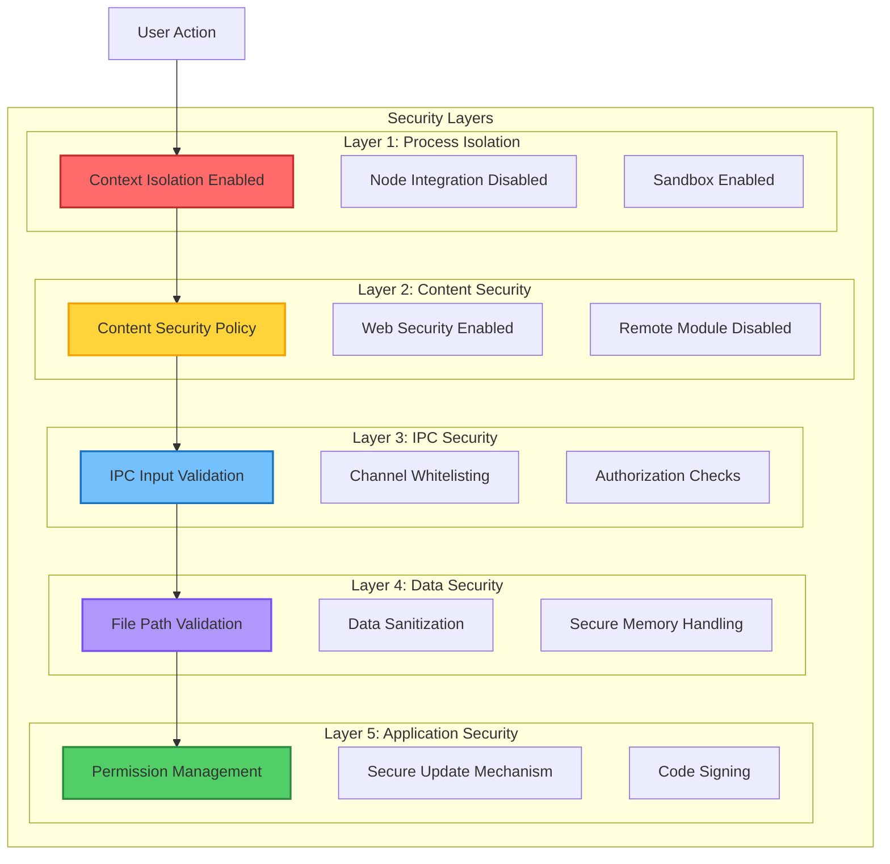

**Security Checklist:**

- ✅ **Context Isolation**: Enabled - Renderer cannot access Node.js globals
- ✅ **Node Integration**: Disabled - No direct Node.js access in renderer
- ✅ **Remote Module**: Disabled - Prevents remote code execution
- ✅ **Content Security Policy**: Enforced - Blocks unauthorized scripts
- ✅ **WebSecurity**: Enabled - Enforces same-origin policy
- ✅ **Sandbox**: Enabled - OS-level process sandboxing
- ✅ **IPC Validation**: All inputs validated and sanitized
- ✅ **File Path Validation**: Prevents directory traversal attacks
- ✅ **Preload Script**: Minimal API exposure through context bridge

**IPC Security Pattern:**
```typescript
// Secure IPC channel definition in preload.ts
contextBridge.exposeInMainWorld('electronAPI', {
  openFile: () => ipcRenderer.invoke('dialog:openFile'),
  readFile: (path: string) => ipcRenderer.invoke('file:read', path),
  saveFile: (path: string) => ipcRenderer.invoke('dialog:saveFile', path)
});
```

---

### Data Flow

Understanding how data moves through the application is crucial for debugging and feature development.

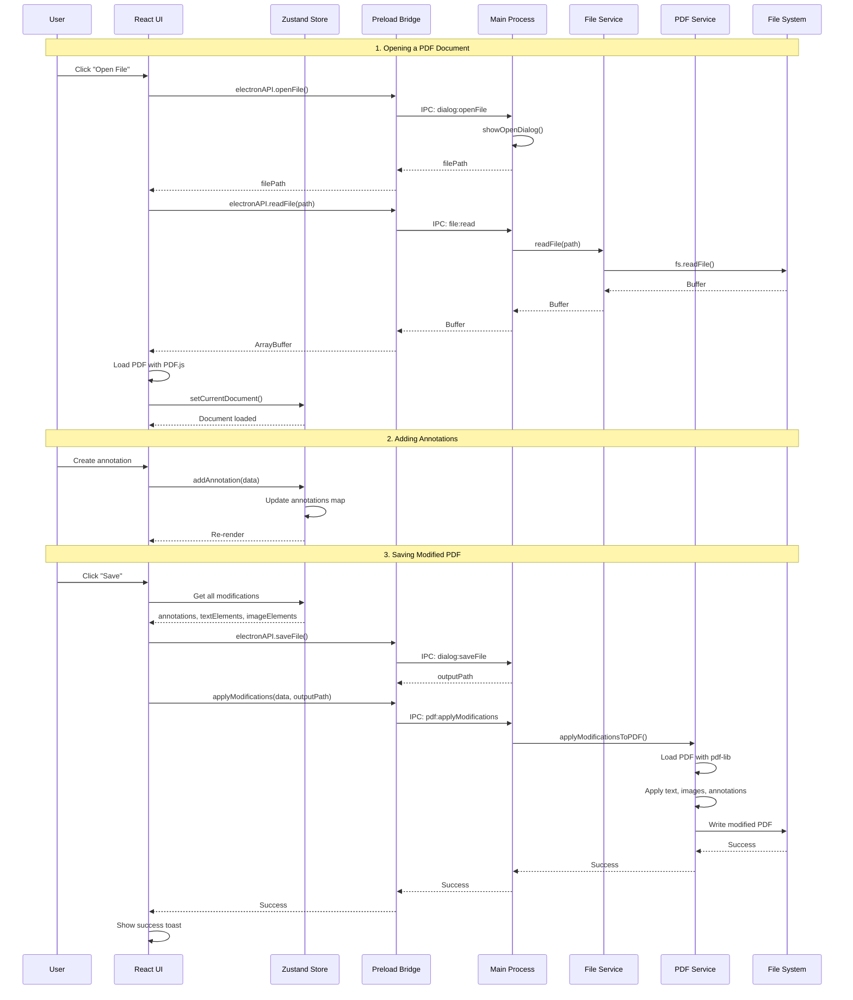

**Key Data Flow Patterns:**

1. **File Operations**: Always go through main process with validation
2. **State Updates**: Centralized in Zustand store with immutable updates
3. **PDF Rendering**: Handled in renderer using PDF.js (no main process)
4. **PDF Manipulation**: Handled in main process using pdf-lib
5. **Annotations**: Stored in-memory, persisted on save or export

---

### Component Architecture

The renderer process follows a modular component architecture with clear separation of concerns.

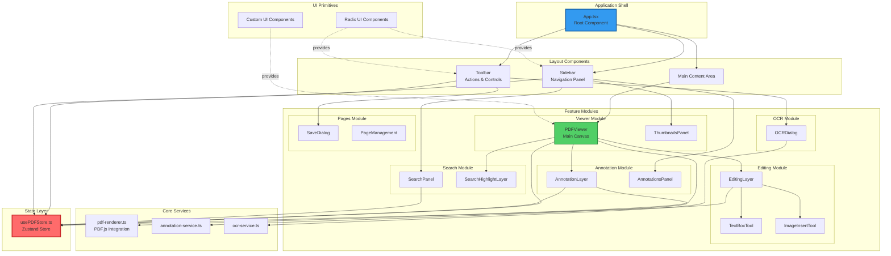

**Component Hierarchy:**

```
App.tsx
├── Toolbar.tsx                 (File operations, zoom, search, OCR, theme)
├── Sidebar.tsx                 (Tab navigation: thumbnails, annotations, search)
│   ├── ThumbnailsPanel.tsx
│   ├── AnnotationsPanel.tsx
│   └── SearchPanel.tsx
├── PDFViewer.tsx              (Main canvas and overlay composition)
│   ├── [PDF Canvas]           (Rendered by PDF.js)
│   ├── SearchHighlightLayer   (Search result highlights)
│   ├── AnnotationLayer        (User annotations)
│   └── EditingLayer           (Text and image overlays)
│       ├── TextBoxTool
│       └── ImageInsertTool
├── SaveDialog.tsx             (Export configuration)
├── OCRDialog.tsx              (OCR processing)
└── PageManagement.tsx         (Page operations - partial)
```

---

### State Management

State is managed using **Zustand**, providing a lightweight, type-safe, and performant state solution.

```mermaid
graph TB
    subgraph "Zustand Store Structure"
        direction TB

        subgraph "Document State"
            DocMeta[currentDocument<br/>id, name, path, pageCount, fileSize]
            DocReady[isDocumentReady: boolean]
            CurrentPage[currentPage: number]
        end

        subgraph "View State"
            Zoom[zoom: number]
            ViewMode[viewMode: 'single' | 'continuous']
            Theme[theme: 'light' | 'dark']
            Sidebar[sidebarTab: string]
        end

        subgraph "Annotation State"
            Annotations[annotations: Map<pageNumber, Annotation[]>]
            ActiveAnnotation[activeAnnotationId: string | null]
            AnnotationMode[annotationMode: AnnotationType]
        end

        subgraph "Editing State"
            TextElements[textElements: Map<pageNumber, TextElement[]>]
            ImageElements[imageElements: Map<pageNumber, ImageElement[]>]
            EditMode[editMode: 'text' | 'image' | null]
        end

        subgraph "Search State"
            SearchQuery[searchQuery: string]
            SearchResults[searchResults: SearchResult[]]
            CurrentResult[currentSearchIndex: number]
        end

        subgraph "OCR State"
            OCRResults[ocrResults: Map<pageNumber, OCRResult>]
            OCRProgress[ocrProgress: number]
            OCRActive[isOCRProcessing: boolean]
        end

        subgraph "Actions"
            DocActions[setDocument, resetDocument]
            ViewActions[setZoom, setPage, toggleTheme]
            AnnotActions[addAnnotation, updateAnnotation, deleteAnnotation]
            EditActions[addTextElement, addImageElement]
            SearchActions[setSearchQuery, nextResult, prevResult]
            OCRActions[processOCR, saveOCRResult]
        end
    end

    Components[React Components] --> |read| DocMeta
    Components --> |read| Annotations
    Components --> |read| SearchResults

    Components --> |dispatch| DocActions
    Components --> |dispatch| AnnotActions
    Components --> |dispatch| SearchActions

    DocActions --> |update| DocMeta
    AnnotActions --> |update| Annotations
    SearchActions --> |update| SearchResults

    style Components fill:#51cf66,stroke:#2b8a3e,stroke-width:2px
    style DocActions fill:#339af0,stroke:#1864ab,stroke-width:2px
    style Annotations fill:#ff6b6b,stroke:#c92a2a,stroke-width:2px
```

**Store Organization:**

The store is located in `src/renderer/store/usePDFStore.ts` and follows this structure:

```typescript
interface PDFStore {
  // Document state
  currentDocument: PDFDocumentMeta | null;
  isDocumentReady: boolean;
  currentPage: number;

  // View state
  zoom: number;
  theme: 'light' | 'dark';
  sidebarTab: string;

  // Annotation state (page-keyed maps)
  annotations: Map<number, Annotation[]>;

  // Editing state (page-keyed maps)
  textElements: Map<number, TextElement[]>;
  imageElements: Map<number, ImageElement[]>;

  // Search state
  searchResults: SearchResult[];

  // OCR state (page-keyed map)
  ocrResults: Map<number, OCRResult>;

  // Actions
  setCurrentDocument: (doc: PDFDocumentMeta) => void;
  addAnnotation: (annotation: Annotation) => void;
  // ... more actions
}
```

**Key Design Decisions:**
- **Page-keyed Maps**: Annotations, text elements, and OCR results are stored as `Map<pageNumber, T[]>` for efficient page-specific access
- **Immutable Updates**: All state updates create new references to trigger React re-renders
- **No Middleware**: Direct state updates for performance
- **Selective Subscriptions**: Components subscribe only to needed state slices

---

### IPC Communication

All communication between renderer and main processes goes through secure, validated IPC channels.

```mermaid
graph LR
    subgraph "Renderer Process"
        Component[React Component]
        PreloadAPI[window.electronAPI]
    end

    subgraph "Preload Script"
        direction TB
        ContextBridge[contextBridge.exposeInMainWorld]
        IPCRenderer[ipcRenderer.invoke/send]
        Validation[Input Validation]
    end

    subgraph "Main Process"
        direction TB
        IPCMain[ipcMain.handle/on]
        Handlers[IPC Handlers]
        Services[Services Layer]
    end

    Component --> |call| PreloadAPI
    PreloadAPI --> ContextBridge
    ContextBridge --> Validation
    Validation --> IPCRenderer

    IPCRenderer <-.IPC Channel.-> IPCMain

    IPCMain --> Handlers
    Handlers --> Services
    Services --> |result| Handlers
    Handlers --> |result| IPCMain
    IPCMain -.reply.-> IPCRenderer
    IPCRenderer --> |result| Component

    style ContextBridge fill:#ff6b6b,stroke:#c92a2a,stroke-width:3px
    style IPCMain fill:#339af0,stroke:#1864ab,stroke-width:2px
```

**IPC Channel Registry:**

| Channel Name | Direction | Purpose | Return Type |
|--------------|-----------|---------|-------------|
| `dialog:openFile` | Renderer → Main | Show file picker | `{path: string, name: string, size: number}` |
| `dialog:saveFile` | Renderer → Main | Show save dialog | `string` (path) |
| `file:read` | Renderer → Main | Read file as buffer | `Buffer` |
| `file:write` | Renderer → Main | Write buffer to file | `void` |
| `file:getInfo` | Renderer → Main | Get file metadata | `FileInfo` |
| `pdf:applyModifications` | Renderer → Main | Apply edits to PDF | `void` |
| `pdf:extractPages` | Renderer → Main | Extract page range | `void` |
| `pdf:merge` | Renderer → Main | Merge multiple PDFs | `void` |
| `pdf:rotate` | Renderer → Main | Rotate pages | `void` |
| `annotations:save` | Renderer → Main | Save annotations JSON | `void` |
| `annotations:load` | Renderer → Main | Load annotations JSON | `Annotation[]` |

**Example IPC Flow:**

```typescript
// 1. Renderer initiates call
const filePath = await window.electronAPI.openFile();

// 2. Preload bridges to IPC
const preload = {
  openFile: () => ipcRenderer.invoke('dialog:openFile')
};

// 3. Main handles request
ipcMain.handle('dialog:openFile', async () => {
  const result = await dialog.showOpenDialog({
    properties: ['openFile'],
    filters: [{ name: 'PDFs', extensions: ['pdf'] }]
  });
  return result.filePaths[0];
});
```

---

### File System Architecture

File operations are abstracted through service layers with security validation.

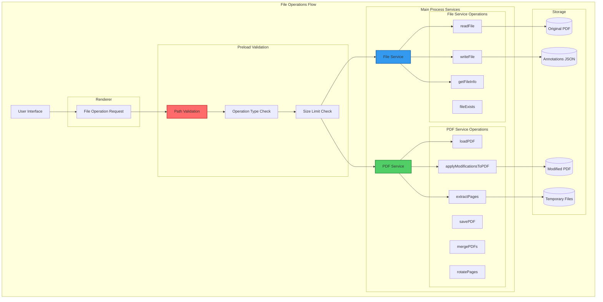

**File Service API** (`src/main/services/file-service.ts`):

```typescript
class FileService {
  async readFile(filePath: string): Promise<Buffer>
  async writeFile(filePath: string, data: Buffer): Promise<void>
  async getFileInfo(filePath: string): Promise<FileInfo>
  async fileExists(filePath: string): Promise<boolean>
}
```

**PDF Service API** (`src/main/services/pdf-service.ts`):

```typescript
class PDFService {
  async applyModificationsToPDF(
    sourcePath: string,
    modifications: Modifications,
    outputPath: string
  ): Promise<void>

  async extractPages(
    sourcePath: string,
    pageNumbers: number[],
    outputPath: string
  ): Promise<void>

  async mergePDFs(
    sourcePaths: string[],
    outputPath: string
  ): Promise<void>

  async rotatePages(
    sourcePath: string,
    rotations: Map<number, number>,
    outputPath: string
  ): Promise<void>
}
```

**Security Validations:**

1. **Path Validation**: Prevent directory traversal (`../../`)
2. **Extension Check**: Ensure `.pdf` extension for PDF operations
3. **Size Limits**: Enforce maximum file size (configurable)
4. **Existence Check**: Verify file exists before reading
5. **Write Permission**: Check write access before saving
6. **Temporary File Cleanup**: Remove temp files after operations

---

## Features

### Core Features

Portable Document Formatter provides a comprehensive set of features for PDF viewing, editing, annotation, and processing.

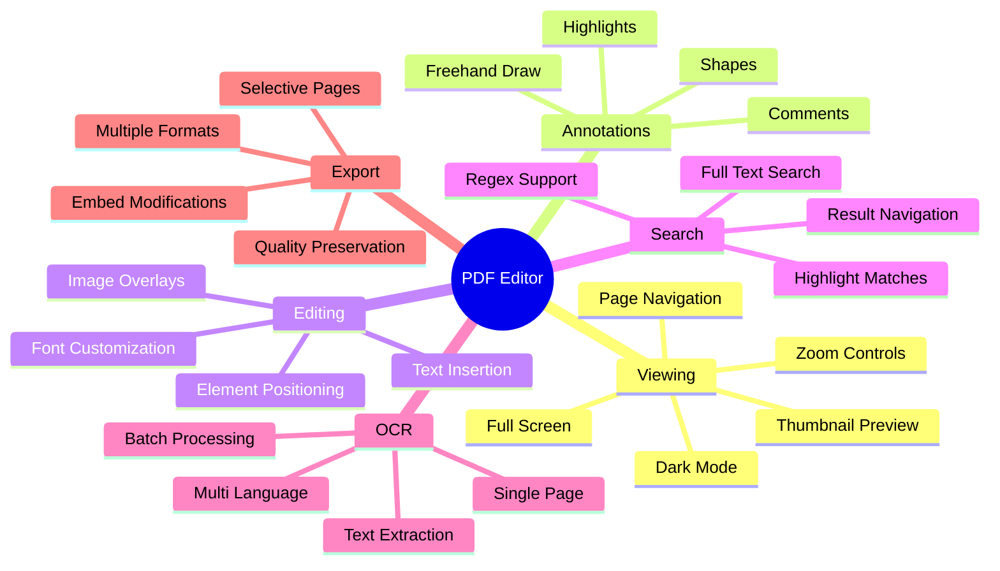

---

### PDF Viewing

Advanced PDF rendering with smooth navigation and intuitive controls.

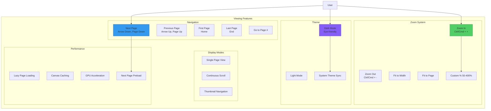

**Keyboard Shortcuts:**

| Action | Windows/Linux | macOS |
|--------|---------------|-------|
| Zoom In | `Ctrl + +` | `Cmd + +` |
| Zoom Out | `Ctrl + -` | `Cmd + -` |
| Reset Zoom | `Ctrl + 0` | `Cmd + 0` |
| Next Page | `↓` / `PgDn` | `↓` / `PgDn` |
| Previous Page | `↑` / `PgUp` | `↑` / `PgUp` |
| First Page | `Home` | `Home` |
| Last Page | `End` | `End` |
| Toggle Dark Mode | `Ctrl + D` | `Cmd + D` |

**Features:**
- **Smooth Zoom**: 50% to 400% with GPU-accelerated rendering
- **Thumbnail Sidebar**: Visual page navigation with lazy-loaded previews
- **Page Indicators**: Current page / total pages display
- **Auto Dark Mode**: Sync with system theme preferences
- **Fast Rendering**: PDF.js-powered engine with canvas caching

---

### Annotation System

Comprehensive annotation tools for marking up and commenting on PDFs.

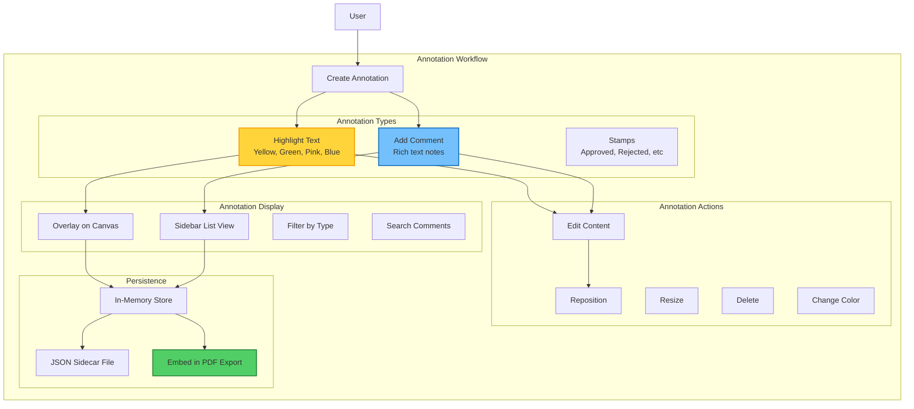

**Annotation Types:**

| Type | Description | Colors Available | Editable |
|------|-------------|------------------|----------|
| **Highlight** | Text highlighting | Yellow, Green, Pink, Blue, Custom | Yes |
| **Comment** | Text annotations with notes | N/A | Yes |
| **Stamp** | Predefined stamps | N/A | No |

**Annotation Data Model:**

```typescript
interface Annotation {
  id: string;
  pageNumber: number;
  type: 'highlight' | 'comment' | 'stamp';
  color: string;
  createdAt: Date;
  updatedAt: Date;
  data: {
    // Position and bounds
    x: number;
    y: number;
    width: number;
    height: number;

    // Content
    text?: string;          // For comments
    highlightedText?: string; // For highlights

    // Metadata
    author?: string;
    resolved?: boolean;
  };
}
```

**Features:**
- **Rich Comments**: Add detailed notes to any annotation
- **Color Coding**: Organize highlights by color
- **Sidebar View**: Browse all annotations in chronological order
- **Page Context**: Click annotation to jump to page location
- **Export Options**: Save as sidecar JSON or embed in PDF
- **Non-Destructive**: Original PDF remains unchanged until export

---

### Text and Image Editing

Insert custom text and images directly onto PDF pages with precise positioning.

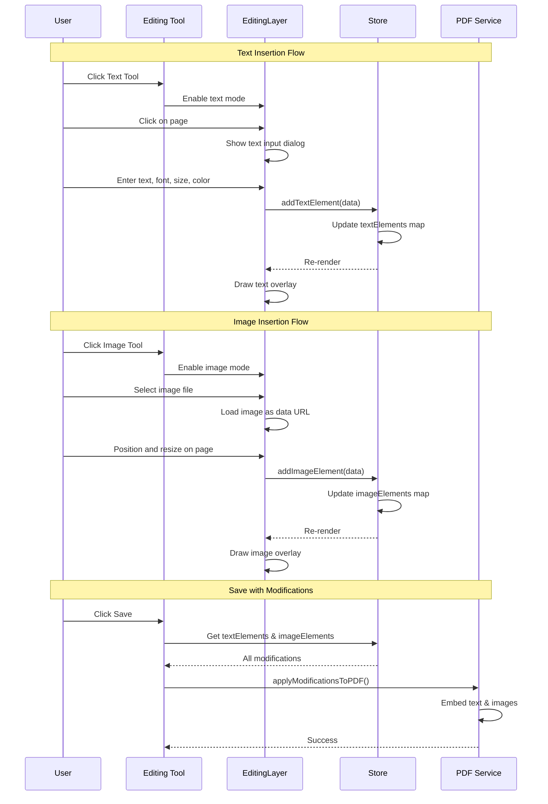

**Text Editing Features:**

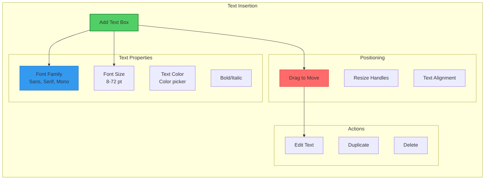

**Image Editing Features:**

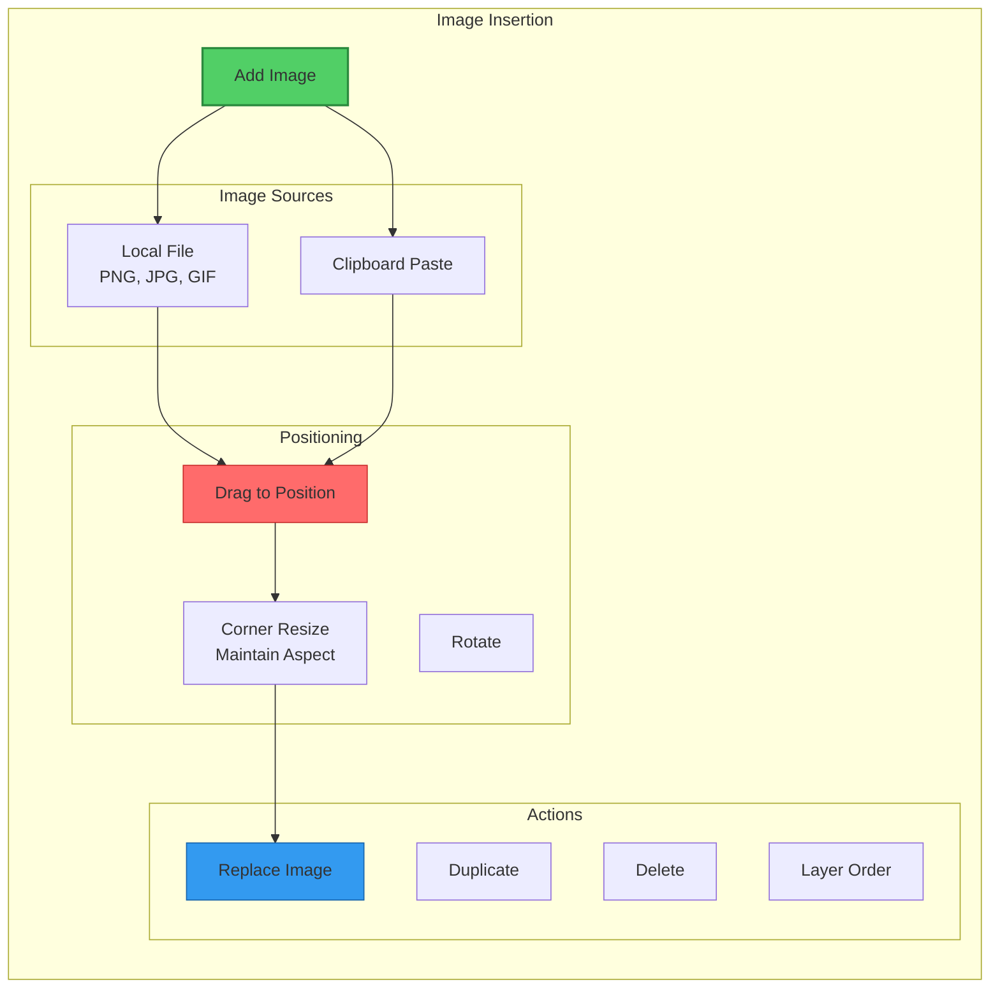

**Text Element Data:**

```typescript
interface TextElement {
  id: string;
  pageNumber: number;
  x: number;           // X position in PDF units
  y: number;           // Y position in PDF units
  width: number;
  height: number;
  text: string;
  fontSize: number;    // 8-72 points
  fontFamily: 'sans' | 'serif' | 'mono';
  color: string;       // Hex color
  bold: boolean;
  italic: boolean;
}
```

**Image Element Data:**

```typescript
interface ImageElement {
  id: string;
  pageNumber: number;
  x: number;
  y: number;
  width: number;
  height: number;
  data: string;        // Base64 data URL
  rotation: number;    // Degrees
  opacity: number;     // 0-1
}
```

**Features:**
- **Rich Text**: Multiple fonts, sizes, colors, and styles
- **Image Support**: PNG, JPG, GIF with transparency
- **Drag & Drop**: Intuitive positioning with visual feedback
- **Resize Handles**: Corner handles for proportional resizing
- **Keyboard Controls**: Arrow keys for fine positioning
- **Z-Index Management**: Control overlay stacking order
- **Preview Mode**: See exactly how it will appear in saved PDF

---

### Search Functionality

Powerful full-text search with result highlighting and navigation.

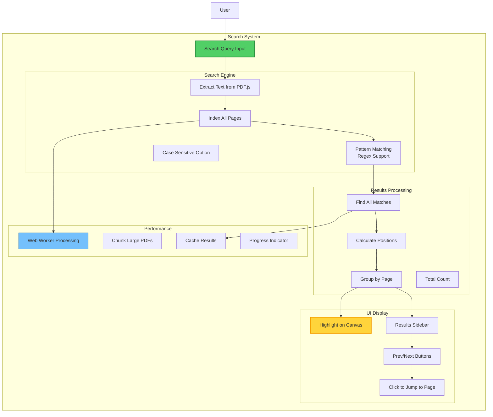

**Search Capabilities:**

| Feature | Description | Example |
|---------|-------------|---------|
| **Literal Search** | Exact text matching | `invoice` |
| **Case Sensitive** | Match exact case | `Invoice` ≠ `invoice` |
| **Whole Word** | Match complete words | `port` won't match `report` |
| **Regex Support** | Pattern matching | `\d{3}-\d{4}` for phone numbers |
| **Multi-Page** | Search entire document | All pages indexed |

**Search Result Data:**

```typescript
interface SearchResult {
  pageNumber: number;
  matchIndex: number;   // Match number on page
  text: string;         // Matched text
  context: string;      // Surrounding text
  position: {
    x: number;
    y: number;
    width: number;
    height: number;
  };
}
```

**Search Flow:**

1. **User enters query** → Input validated
2. **PDF.js extracts text** → All pages processed
3. **Pattern matching** → Find all matches
4. **Position calculation** → Get bounding boxes
5. **Results display** → Sidebar list + canvas highlights
6. **Navigation** → Click result to jump to page
7. **Highlight** → Yellow overlay on matched text

**Features:**
- **Instant Search**: Fast indexing with Web Worker
- **Live Highlighting**: Visual feedback on canvas
- **Result Count**: "23 matches on 5 pages"
- **Context Preview**: Show surrounding text in results
- **Keyboard Navigation**: `F3` / `Shift+F3` for next/prev
- **Persistent Highlights**: Remain visible while browsing

---

### OCR and Multi-Format Extraction (Phase 1)

Extract structured text from a wide range of document formats using the **MarkItDown** engine and the **Strategy Pattern** architecture.

#### Overview
Phase 1 introduces a major upgrade to the document extraction system. Instead of relying solely on client-side OCR for PDFs, the application now supports multiple formats and leverages a dedicated Python-based microservice for high-fidelity Markdown extraction.

#### Supported Formats
- **PDF**: Advanced layout preservation and text extraction.
- **Office Documents**: `.docx`, `.pptx`, `.xlsx`.
- **Images**: `.jpg`, `.png`, `.tiff` (via OCR).
- **Other**: `.html`, `.csv`, `.md`.

#### Architecture: Strategy Pattern
The extraction system uses the Strategy Pattern to dynamically select the most appropriate processor:

1. **MarkItDownProcessor**: The primary processor, which communicates with a FastAPI microservice. It is ideal for structured documents and multi-format support.
2. **TesseractProcessor**: A fallback processor that uses `Tesseract.js` for local OCR on images or when the microservice is unavailable.

#### Process Flow (MarkItDown)
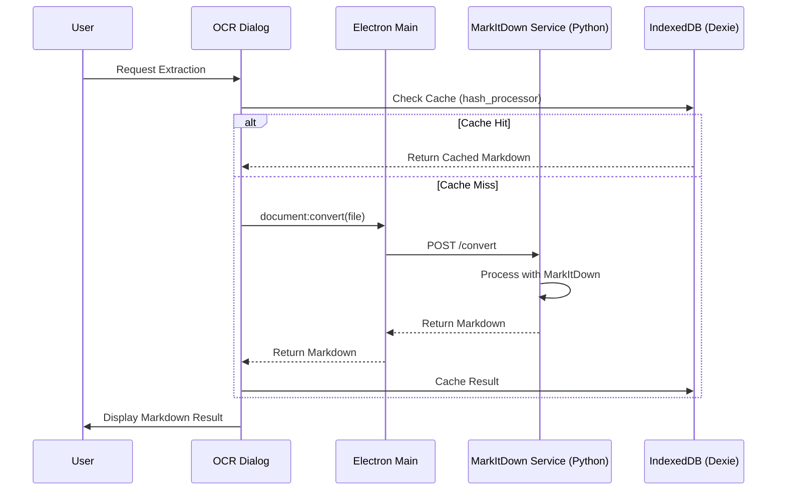

#### Result Persistence
All extraction results are cached locally using **IndexedDB (Dexie.js)**. The cache key is generated based on a composite of the file path, size, and modification time to ensure that results are reused correctly across sessions while still reflecting any changes to the source document.

---
    subgraph "Multi-Format Extraction Pipeline"
        direction TB

        subgraph "Input Stage"
            DocFile[Document File<br/>.pdf, .docx, .pptx, etc.]
            ProcessorSelect[Strategy Selection]
        end

        subgraph "Extraction Stage"
            MIDEngine[MarkItDown Service]
            TessEngine[Tesseract Fallback]
            FastAPI[FastAPI Server]
        end

        subgraph "Processing"
            Conversion[Markdown Conversion]
            LayoutPreserve[Layout Preservation]
            Metadata[Metadata Extraction]
        end

        subgraph "Persistence"
            ResultCache[IndexedDB Cache]
            StoreResult[Update Store]
        end

        subgraph "Output Stage"
            MarkdownOut[Structured Markdown]
            PreviewUI[Markdown Preview UI]
            ExportMD[Export as MD/JSON]
        end
    end

    DocFile --> ProcessorSelect
    ProcessorSelect --> MIDEngine
    ProcessorSelect --> TessEngine
    
    MIDEngine --> FastAPI
    FastAPI --> Conversion
    
    Conversion --> LayoutPreserve
    LayoutPreserve --> ResultCache
    
    ResultCache --> StoreResult
    StoreResult --> MarkdownOut
    MarkdownOut --> PreviewUI
    MarkdownOut --> ExportMD

    style MIDEngine fill:#339af0,stroke:#1864ab,stroke-width:2px
    style FastAPI fill:#51cf66,stroke:#2b8a3e,stroke-width:2px
    style ResultCache fill:#ff922b,stroke:#d9480f,stroke-width:2px
```

**Extraction Features (Phase 1):**

| Feature | Description |
|---------|-------------|
| **Multi-Format** | Support for PDF, DOCX, PPTX, XLSX, HTML, Images |
| **Markdown Output** | High-fidelity structured Markdown results |
| **Hybrid Strategy** | Automatic fallback from MarkItDown to Tesseract |
| **Result Caching** | Persistent cache via IndexedDB (Dexie.js) |
| **Preview UI** | Real-time Markdown rendering in OCRDialog |
| **Export Formats** | Export as Markdown, Plain Text, or JSON |

**Extraction Result Data:**

```typescript
interface ExtractionResult {
  id: string;                // File hash + processor
  text: string;              // Markdown formatted text
  processor: 'markitdown' | 'tesseract';
  processingTime: number;     // Milliseconds
  timestamp: number;
  metadata: {
    format: string;
    pageCount?: number;
  };
}
```

**Performance & Scalability:**
- **Microservice Isolation**: Python backend prevents heavy processing from blocking Electron Main/Renderer.
- **Async Processing**: Subprocess management ensures responsive UI during long conversions.
- **Cache Hits**: Near-zero latency for previously processed files.

---

### Save and Export

Flexible export system with selective page ranges and embedded modifications.

```mermaid
graph TB
    subgraph "Save/Export Flow"
        SaveBtn[Click Save Button]

        subgraph "Export Options"
            PageRange[Select Page Range<br/>All or Custom]
            ParseRange[Parse Range<br/>"1-3, 5, 7-9"]
            Modifications[Gather Modifications<br/>Text, Images, Annotations]
        end

        subgraph "Processing Path"
            direction LR

            AllPages{All Pages?}

            FullDoc[Use Full Document]
            ExtractPages[Extract Selected Pages]

            ApplyMods[Apply Modifications]
            EmbedText[Embed Text Elements]
            EmbedImages[Embed Image Elements]
            EmbedAnnotations[Embed Annotations]
        end

        subgraph "Output"
            SaveDialog[Save File Dialog]
            WritePDF[Write PDF to Disk]
            VerifyOutput[Verify Output]
            ShowSuccess[Show Success Toast]
        end
    end

    User[User] --> SaveBtn
    SaveBtn --> PageRange
    PageRange --> ParseRange
    ParseRange --> Modifications

    Modifications --> AllPages
    AllPages -->|Yes| FullDoc
    AllPages -->|No| ExtractPages

    FullDoc --> ApplyMods
    ExtractPages --> ApplyMods

    ApplyMods --> EmbedText
    EmbedText --> EmbedImages
    EmbedImages --> EmbedAnnotations

    EmbedAnnotations --> SaveDialog
    SaveDialog --> WritePDF
    WritePDF --> VerifyOutput
    VerifyOutput --> ShowSuccess

    style ApplyMods fill:#51cf66,stroke:#2b8a3e,stroke-width:2px
    style EmbedText fill:#339af0,stroke:#1864ab,stroke-width:2px
    style WritePDF fill:#ff6b6b,stroke:#c92a2a,stroke-width:2px
```

**Page Range Syntax:**

| Input | Description | Result |
|-------|-------------|--------|
| `1-5` | Pages 1 through 5 | 5 pages |
| `1,3,5` | Specific pages | 3 pages |
| `1-3,7-9` | Multiple ranges | 6 pages |
| `2-` | Page 2 to end | N pages |
| `-5` | First 5 pages | 5 pages |
| (empty) | All pages | All pages |

**Export Process:**

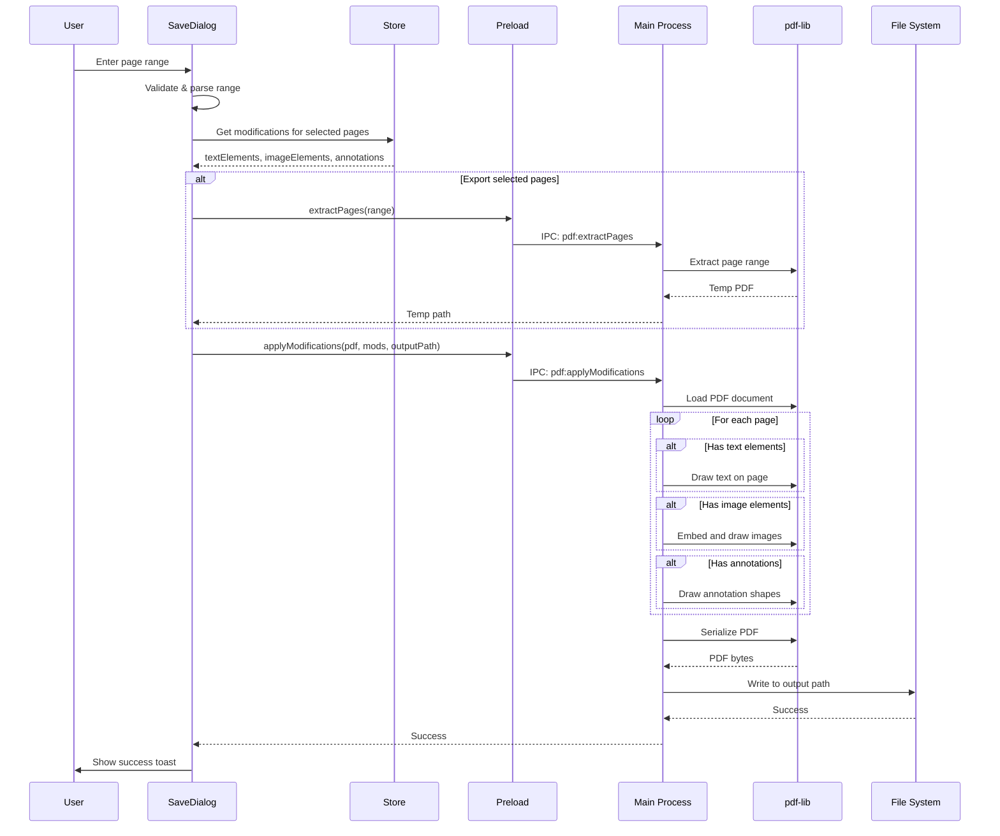

**Modification Application:**

The `applyModificationsToPDF()` function in `src/main/services/pdf-service.ts` embeds modifications:

1. **Load PDF**: Parse with pdf-lib
2. **For each page**:
   - **Text Elements**: Draw using `page.drawText()` with font, size, color
   - **Image Elements**: Embed PNG/JPG and draw with `page.drawImage()`
   - **Annotations**:
     - Highlights → Draw colored rectangles with transparency
     - Comments → Draw callout shapes with text
3. **Serialize**: Generate final PDF bytes
4. **Write**: Save to selected output path

**Features:**
- **Non-Destructive**: Original PDF never modified
- **Selective Export**: Choose specific pages or ranges
- **Quality Preservation**: No lossy compression
- **Fast Processing**: Efficient pdf-lib operations
- **Validation**: Verify page ranges before export
- **Progress Feedback**: Show progress for large documents
- **Auto-Naming**: Suggest filename based on original
- **Overwrite Protection**: Confirm before overwriting existing file

---

### UI/UX Features

Modern, accessible interface with attention to detail.

```mermaid
graph TB
    subgraph "UI/UX Architecture"
        direction TB

        subgraph "Component Library"
            RadixUI[Radix UI<br/>Accessible Primitives]
            TailwindCSS[Tailwind CSS<br/>Utility Styling]
            Lucide[Lucide Icons<br/>Consistent Icons]
        end

        subgraph "Theme System"
            LightTheme[Light Theme]
            DarkTheme[Dark Theme]
            SystemSync[System Preference Sync]
            CustomColors[Custom Color Palette]
        end

        subgraph "Responsive Design"
            FlexLayout[Flexbox Layout]
            GridSystem[CSS Grid]
            AdaptiveUI[Adaptive Toolbar]
            MinMaxSize[Min/Max Window Size]
        end

        subgraph "Accessibility"
            KeyboardNav[Full Keyboard Navigation]
            ScreenReader[Screen Reader Support]
            FocusManage[Focus Management]
            ARIALabels[ARIA Labels]
            HighContrast[High Contrast Mode]
        end

        subgraph "Feedback Systems"
            Toasts[Toast Notifications]
            LoadingStates[Loading Indicators]
            ErrorHandling[Error Messages]
            ProgressBars[Progress Indicators]
            Tooltips[Contextual Tooltips]
        end

        subgraph "Performance"
            VirtualScroll[Virtual Scrolling]
            LazyRender[Lazy Rendering]
            MemoizedComps[Memoized Components]
            GPUAccel[GPU Acceleration]
        end
    end

    RadixUI --> LightTheme
    RadixUI --> KeyboardNav
    TailwindCSS --> FlexLayout

    LightTheme --> SystemSync
    DarkTheme --> SystemSync

    KeyboardNav --> FocusManage
    FocusManage --> Toasts

    FlexLayout --> VirtualScroll

    style RadixUI fill:#845ef7,stroke:#5f3dc4,stroke-width:2px
    style DarkTheme fill:#212529,stroke:#495057,stroke-width:2px
    style KeyboardNav fill:#51cf66,stroke:#2b8a3e,stroke-width:2px
    style VirtualScroll fill:#339af0,stroke:#1864ab,stroke-width:2px
```

**Design System:**

| Component | Technology | Purpose |
|-----------|------------|---------|
| **Dialog** | Radix Dialog | Modals for OCR, Save, Settings |
| **Dropdown** | Radix Dropdown Menu | Context menus, options |
| **Tooltip** | Radix Tooltip | Contextual help |
| **Slider** | Radix Slider | Zoom control |
| **Tabs** | Radix Tabs | Sidebar navigation |
| **Toast** | Radix Toast | Notifications |
| **Button** | Custom | Primary actions |
| **Icons** | Lucide React | Consistent iconography |

**Keyboard Shortcuts Reference:**

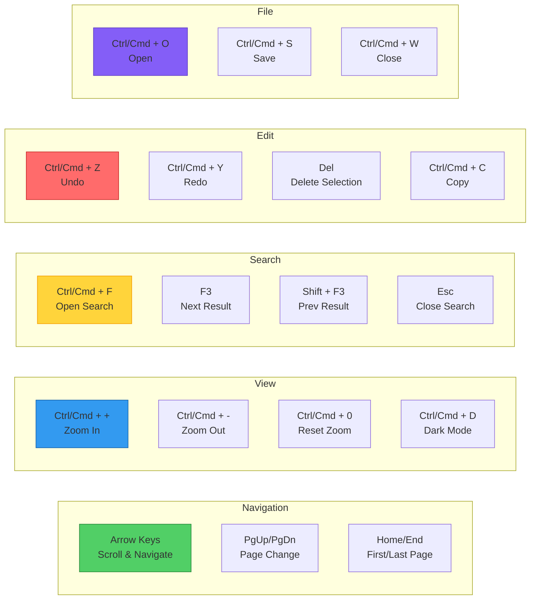

**Accessibility Features:**

- **WCAG 2.1 Level AA Compliance**
- **Keyboard Navigation**: All features accessible via keyboard
- **Screen Reader**: Proper ARIA labels and roles
- **Focus Indicators**: Clear visual focus states
- **High Contrast**: Support for high contrast modes
- **Text Scaling**: Respects OS text size settings
- **Color Blindness**: Not relying solely on color for information

**Responsive Layout:**

- **Minimum Window Size**: 800x600 pixels
- **Adaptive Toolbar**: Collapses to icon-only on narrow windows
- **Collapsible Sidebar**: Toggle for more viewing space
- **Floating Dialogs**: Centered modals with backdrop
- **Touch Support**: Future consideration for touch screens

---

## Conclusion

This documentation provides a comprehensive technical overview of the Portable Document Formatter architecture and features. For implementation details, refer to the [ARCHITECTURE.md](ARCHITECTURE.md) file and inline code documentation.

**Quick Links:**
- [README.md](README.md) - Getting started guide
- [ARCHITECTURE.md](ARCHITECTURE.md) - Detailed architecture notes
- [LICENSE](LICENSE) - MIT License

**Need Help?**
- Report issues on GitHub
- Check troubleshooting section in README
- Review inline code comments
- Consult Electron and React documentation

---

**Document Version**: 1.0
**Last Updated**: 2026-04-18
**Maintained By**: Development Team
