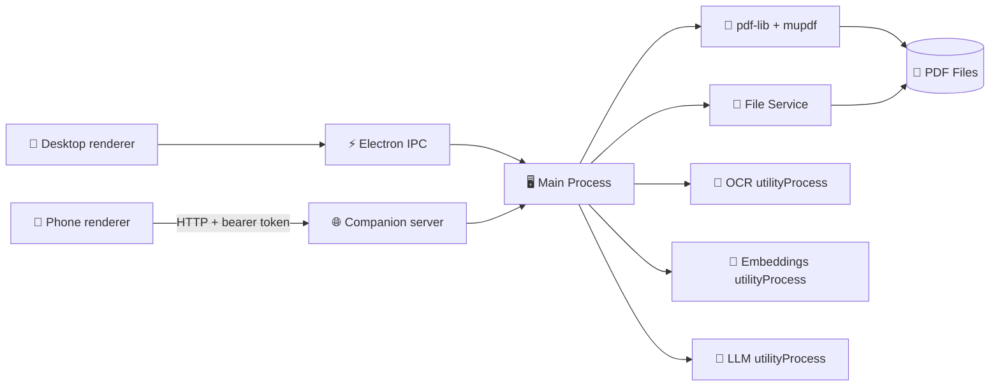

<div align="center">
  

  # Portable Document Formatter

  ### 🚀 A Modern, Feature-Rich PDF Editor Built with Electron

  **View • Annotate • Edit • OCR • Export • Mobile Companion** — All in one beautiful desktop app

  [](https://opensource.org/licenses/MIT)
  [](https://www.electronjs.org/)
  [](https://reactjs.org/)
  [](https://www.typescriptlang.org/)
  [](http://makeapullrequest.com)

  [Features](#-features) • [Installation](#-installation) • [Usage](#-usage) • [Tech Stack](#-tech-stack) • [Contributing](#-contributing)

</div>

---

## ✨ Features

### 📄 **Advanced PDF Viewing**
- 🔍 **Zoom & Navigation** — Smooth zooming with intuitive page controls
- 🖼️ **Thumbnail Sidebar** — Quick navigation with visual page previews
- 🌓 **Dark Mode** — Easy on the eyes with beautiful dark theme support
- ⚡ **Fast Rendering** — Powered by PDF.js for lightning-fast page rendering

### ✏️ **Powerful Editing Tools**
- 🎨 **Highlight Annotations** — Mark important sections with customizable highlights
- 💬 **Comment System** — Add notes and comments to your annotations
- 📝 **Text Overlays** — Insert custom text directly onto PDF pages
- 🖼️ **Image Insertion** — Add images and graphics to your documents
- 📊 **Non-Destructive Editing** — Original PDFs remain untouched until you save
- ✍️ **In-place text editing** — Click any text in the document to edit it; the byte-surgery engine rewrites the original PDF content stream byte-for-byte, preserving the original font and spacing
- 🔬 **Edit engine status** — Per-edit color-coded indicator: green = byte-surgery (vector-perfect), orange = legacy redraw, red = refused; tooltip shows the reason
- ⚙️ **Engine mode toggle** — Switch between Auto / Strict / Legacy-only in Settings; persisted across sessions
- 📊 **Session telemetry** — Settings dialog footer shows `N edits this session (M byte-surgery / K legacy / L refused)` for the current session

### 🔎 **Smart Search & Extraction**
- 🔍 **Full-Text Search** — Find any text across your entire document
- 📍 **Result Highlighting** — Visual highlights for all search matches
- 🤖 **Multi-Format Extraction** — Extract structured Markdown from PDF, Office docs, and images
- 🚀 **High-Performance Backend** — Powered by Microsoft MarkItDown via FastAPI microservice
- 💾 **Result Caching** — Near-instant access to previously processed documents via IndexedDB

### 💾 **Flexible Export Options**
- 📑 **Selective Export** — Save specific page ranges (e.g., "1-3, 5, 7-9")
- ✅ **Embed Modifications** — All edits are permanently embedded in exported PDFs
- 🔒 **Preserve Quality** — No loss of quality during save operations

### 📱 **Mobile Companion (LAN)**
- 🔌 **In-app server** — Toggle the companion on from Settings to expose the renderer over your local WiFi
- 📷 **QR pairing** — Scan a QR on the desktop to load the app on your phone with a one-shot bearer token
- 🗂️ **Library folder** — Pick a folder on the desktop; only PDFs in it are visible to the phone
- ✏️ **Edit & save remotely** — Annotate on the phone; save lands in the desktop folder *and* downloads to the phone
- 🛡️ **Path-safe** — All file paths are validated via `realpath`; rate-limited token auth; tokens rotate on disable

---

## 📸 Screenshots

<div align="center">
  
  <p><em>Clean, intuitive interface with powerful editing tools</em></p>
</div>

> **Note:** Add screenshots of your app in action by placing them in the `public/screenshots/` folder!

---

## 🚀 Installation

### Download Pre-built Binaries

**macOS** (Universal - Intel & Apple Silicon)
```bash
# Download from releases page
# Or build locally:
npm run dist:mac
```

**Windows** (64-bit)
```bash
# Download from releases page
# Or build locally:
npm run dist:win
```

### Build from Source

#### Prerequisites
- Node.js 18+ ([Download](https://nodejs.org/))
- npm 9+
- Git

#### Quick Start

```bash
# Clone the repository
git clone https://github.com/yourusername/portable-document-formatter.git
cd portable-document-formatter

# Install dependencies
npm install

# Run in development mode
npm run dev

# Build for production
npm run build
```

---

## 📖 Usage

### 🔓 Opening PDFs
1. Click the **folder icon** in the toolbar
2. Select any PDF file from your computer
3. Start viewing and editing immediately

### ✏️ Adding Annotations
1. **Highlight Text**: Select the highlight tool and click-drag on text
2. **Add Comments**: Click on any highlight to add or edit comments
3. **Insert Text**: Choose the text tool and click anywhere on the page
4. **Add Images**: Click the image tool, select an image, and place it

### ✍️ Editing Text In-Place
1. Click the **edit-text tool** (pencil icon) in the toolbar
2. Hover over any text in the document — editable lines are highlighted
3. Click a line to begin editing; press **Enter** or click away to commit
4. Edits are baked into the rendered PDF automatically (debounced, ~250 ms after commit)
5. The bottom border of each committed edit shows its engine path: **green** = byte-surgery (vector-perfect, original font preserved), **orange** = legacy redraw, **red** = refused (hover for reason)
6. To change the engine mode (Auto / Strict / Legacy only), open **Settings** (gear icon)

### 🔍 Searching Documents
1. Click the **search icon** in the toolbar
2. Type your search query
3. Navigate through results with keyboard shortcuts or the sidebar

### 🤖 Document Extraction (OCR & Multi-Format)
1. Open any document or image (.pdf, .docx, .pptx, .xlsx, .png, .jpg)
2. Click the **Extraction** button in the toolbar
3. The system will automatically detect the format and select the best extraction strategy
4. Preview the structured Markdown results and copy/export as needed
5. Frequent documents are cached for near-instant access!

### 💾 Saving Your Work
1. Click the **save button** in the toolbar
2. Choose to save all pages or specify ranges (e.g., `1-5, 8, 10-12`)
3. Select output location
4. Your new PDF will include all edits and annotations!

### 📱 Using the Mobile Companion

The Mobile Companion lets a phone on the same WiFi load the app over the LAN and edit PDFs from a folder you choose on the desktop.

1. On the **desktop**, click the **gear icon** in the toolbar to open Settings.
2. Click **Choose folder** and pick a directory containing the PDFs you want to access from your phone.
3. Click **Enable**. A QR code and a list of LAN URLs appear (e.g. `http://192.168.1.42:8421`).
4. **Scan the QR with your phone's camera.** The renderer loads on the phone and the pairing token is stored in `localStorage`.
5. Tap **Open PDF** on the phone — pick a file from the library, view it, annotate, and tap **Save**. The edited PDF lands in the desktop folder *and* downloads to the phone.

Notes:
- Scan the QR — don't paste `vite --host`'s URL. Vite (port `5173`) is just a dev bundler; the companion server runs on its own port (default `8421`).
- Click **Disable** in Settings to stop the server. The bearer token rotates automatically on disable.
- iOS Safari sometimes inline-previews the saved PDF instead of triggering a download — the desktop folder still gets the file.
- macOS may show a one-time firewall prompt the first time you enable. Click **Allow** so phones on your WiFi can reach the server.

> **Out of scope on mobile (v1):** OCR, embeddings, the local LLM, page management, and "save specific pages." These remain on the desktop.

---

## 🛠️ Tech Stack

Built with modern, production-ready technologies:

| Technology | Purpose |
|------------|---------|
| ⚡ **Electron 28** | Cross-platform desktop framework |
| ⚛️ **React 18** | UI library with hooks |
| 📘 **TypeScript** | Type-safe development |
| 🎨 **Tailwind CSS** | Utility-first styling |
| 🧩 **Radix UI** | Accessible component primitives |
| 📄 **PDF.js** | PDF rendering engine |
| 📝 **pdf-lib** | PDF manipulation and creation |
| 📐 **mupdf** | Structured text extraction for in-place editing |
| 🤖 **PaddleOCR (`@gutenye/ocr-node`)** | OCR text extraction in a `utilityProcess` |
| 🐻 **Zustand** | Lightweight state management |
| 🌐 **Node `http` + `qrcode`** | Mobile companion server + QR pairing |
| ⚡ **Vite** | Lightning-fast build tool |
| 🧪 **Vitest** | Modern testing framework |
| 🎭 **Playwright** | End-to-end testing |

---

## 🏗️ Architecture



The desktop renderer talks to the main process over Electron IPC (via `window.electronAPI` from `preload.ts`). The mobile renderer is the **same React bundle** loaded over LAN HTTP — at boot, a polyfill at `src/renderer/services/electron-api-http.ts` installs `window.electronAPI` shims that translate the same calls into HTTP requests against the companion server, which calls into the same service singletons. This means a single renderer codebase works on both transports.

📚 **Detailed Architecture**: See [ARCHITECTURE.md](ARCHITECTURE.md) for in-depth technical documentation.

---

## 🗂️ Project Structure

```
portable-document-formatter/
├── 📂 src/
│   ├── 🖥️ main/                                  # Electron main process
│   │   ├── main.ts                               # Entry point & IPC handlers
│   │   ├── preload.ts                            # contextBridge → window.electronAPI
│   │   ├── services/
│   │   │   ├── pdf-service.ts                    # pdf-lib + mupdf editing
│   │   │   ├── file-service.ts                   # FS helpers
│   │   │   ├── ocr-service.ts                    # PaddleOCR utilityProcess driver
│   │   │   ├── embeddings-service.ts             # MiniLM utilityProcess driver
│   │   │   ├── llm-service.ts                    # SmolLM2 utilityProcess driver
│   │   │   ├── companion-config.ts               # Persisted token / port / library
│   │   │   ├── companion-server.ts               # HTTP server lifecycle
│   │   │   └── companion-routes.ts               # /api/* handlers
│   │   └── workers/                              # OCR / embeddings / LLM workers
│   ├── ⚛️ renderer/                              # React application
│   │   ├── components/                           # UI components
│   │   │   ├── features/settings/SettingsDialog  # Companion toggle + QR
│   │   │   └── features/library/LibraryPicker    # Mobile file picker
│   │   ├── services/
│   │   │   └── electron-api-http.ts              # window.electronAPI HTTP polyfill
│   │   ├── store/                                # Zustand state management
│   │   └── types/                                # TypeScript definitions
│   ├── 🧪 tests/                                 # Vitest unit tests
│   ├── 🎭 e2e/                                   # Playwright E2E tests
│   └── 👷 workers/                               # Web workers
├── 📂 public/                                    # Static assets
├── 📂 dist/                                      # Build output (renderer served by companion)
└── 📂 release/                                   # Distribution packages
```

---

## 🗺️ Roadmap

### ✅ Completed
- [x] PDF viewing with zoom and navigation
- [x] Annotation system with comments
- [x] Text and image overlays
- [x] Full-text search with highlighting
- [x] Selective page export
- [x] Dark mode support
- [x] Thumbnail navigation
- [x] PaddleOCR pipeline running in an Electron `utilityProcess`
- [x] Mobile Companion — LAN HTTP server + QR pairing, edit & save from phone
- [x] Welcome screen with drag-and-drop onboarding (`WelcomeHero`)
- [x] Mobile library file picker (`LibraryPicker`)
- [x] Distraction-free Reader Mode (`ReaderMode`)
- [x] Settings dialog with companion toggle + QR display (`SettingsDialog`)
- [x] Context-aware floating toolbar (`FloatingToolbar`)

#### 📝 In-place text editing (Phase 4 — byte-surgery engine)
- [x] **Phase 4a** — Tokenizer + Interpreter (ISO 32000 §7) for PDF content streams
- [x] **Phase 4a** — Locator: maps mupdf line bbox → exact content-stream operator
- [x] **Phase 4c** — Simple-font byte-surgery (Helvetica/Times/Courier with WinAnsi/MacRoman/Standard encodings + `/Differences` overrides)
- [x] **Phase 4c** — Adobe Glyph List for glyph-name ↔ Unicode resolution
- [x] **Phase 4d** — Type0 / Identity-H CID font support via `/ToUnicode` CMap parser (bfchar, bfrange, ligatures, surrogate pairs)
- [x] **Phase 4d** — Hybrid pipeline: byte-surgery first, legacy redact-and-redraw fallback for residuals (per-edit partial success)
- [x] Multi-run distribution for force-kerned headings and TJ arrays with kerning offsets (concat-into-first + same-length char-by-char)
- [x] Whitespace-run partitioning so leading/trailing kerning slots don't shift typed text
- [x] Cross-document state cleanup — switching PDFs no longer leaks edits between documents
- [x] **Phase B** — Programmatic test fixture builders (5 builders) + visual-regression hash snapshots (mupdf pixmap → SHA-256)
- [x] **Phase C — UI polish for the editing engine**
  - Per-edit color-coded status badge: green = byte-surgery, orange = legacy redraw, red = refused; tooltip shows engine reason
  - Missing-glyph warning toast (`refused-encoding-missing` outcome surfaces a destructive toast with edit count)
  - Settings toggle: `Auto` / `Strict` / `Legacy only` engine mode, persisted to `localStorage`
  - Session telemetry counter in Settings footer (byte-surgery / legacy / refused breakdown for the current session)
  - `EditEngineDebugOverlay` — per-edit detail panel behind `?debug=editing` URL flag (path, reason, page, original/new text)
  - `bakeTextEdits` IPC now returns `{ bytes, outcomes[] }` with per-edit `path` and `reason` fields; `engineMode` propagated end-to-end

### 🚧 In Progress

#### 📝 Text-editing engine — remaining work

- [ ] **Phase A — Missing-glyph handling** (tier choice pending — see [Tier 1/2/3](#text-editing-engine--phase-a-tier-choice) below)
  - Detects when a typed character isn't in the PDF's embedded font subset
  - Currently the engine returns `refused-encoding-missing`, fires a toast, and the legacy path takes over (rasterized, slightly different style)
  - Real fix is multi-week font engineering; awaiting tier sign-off

#### Other in-progress
- [ ] Page management — reorder, delete, rotate (UI scaffolded, not yet wired)
- [ ] Export to images (PNG/JPEG)
- [ ] Enhanced annotation tools (shapes, arrows)
- [ ] Companion v1.5: HTTPS via self-signed cert (unlocks iOS clipboard write)
- [ ] Companion v2: WebSocket transport for streaming OCR/LLM on mobile

### 🔮 Future Plans
- [ ] PDF merge/split
- [ ] Form filling capabilities
- [ ] Digital signatures
- [ ] Cloud storage integration (Google Drive, Dropbox)
- [ ] Real-time collaboration
- [ ] Batch processing
- [ ] Plugin system
- [ ] Linux builds

---

### Text-editing engine — Phase A tier choice

The engine refuses an edit when the typed character isn't in the PDF's embedded font subset (e.g. typing `ñ` into a document whose subset only embedded ASCII glyphs). Three realistic implementation tiers, in increasing scope:

| Tier | Scope | Effort | Risk |
|---|---|---|---|
| **1** | `SystemFontResolver` to look up `/BaseFont` in OS font dirs + missing-glyph detection. New outcome status `refused-glyph-not-in-subset`. The Phase C toast already fires on `refused-encoding-missing` — Tier 1 would give it a more precise message. **No font surgery.** | 1–2 days | Low |
| **2** | Embed the system font as a **new** PDF font resource and switch to it via `Tf` in the content stream for the new text. Avoids modifying the existing subset. New text may visually diverge slightly (different hinting/metrics). | 1–2 weeks | Medium |
| **3** | True in-place subset extension — modify embedded `glyf`/`loca`/`hmtx`/`cmap` (TrueType) or CharStrings INDEX (CFF), recompute checksums, update `/ToUnicode` and `/Widths`. No JS library does this — `fontkit` and `harfbuzz-subset` only subset (one-way). | Months | High |

**Decision gate:** how often does the missing-glyph case actually hit on real-world PDFs? Recent test runs showed 8/8 byte-surgery success on the user's corpus, suggesting Tier 1 (warn clearly, never silently misrender) may be the right investment.

---

## 🤝 Contributing

We welcome contributions from the community! Here's how you can help:

### Ways to Contribute
- 🐛 **Report Bugs**: Open an issue describing the problem
- ✨ **Suggest Features**: Share your ideas for new features
- 📝 **Improve Documentation**: Help make our docs better
- 💻 **Submit Pull Requests**: Fix bugs or implement features

### Development Workflow

```bash
# Fork and clone the repo
git clone https://github.com/yourusername/portable-document-formatter.git

# Create a feature branch
git checkout -b feature/amazing-feature

# Make your changes and test
npm run dev
npm test
npm run test:e2e

# Commit with a descriptive message
git commit -m "Add amazing feature"

# Push to your fork
git push origin feature/amazing-feature

# Open a Pull Request
```

### Code Style
- Use TypeScript for type safety
- Follow existing code formatting (Prettier)
- Write tests for new features
- Update documentation as needed

---

## 🧪 Testing

```bash
# Run unit tests
npm test

# Run tests in watch mode
npm run test:watch

# Run E2E tests
npm run test:e2e

# Generate coverage report
npm run test:coverage
```

---

## 📦 Building

### Development Build
```bash
npm run build
```

### Production Builds

**macOS (Universal)**
```bash
# Unsigned (for development)
npm run dist:mac

# Signed (requires Apple Developer credentials)
npm run dist:mac:signed
```

**Windows (64-bit)**
```bash
# Unsigned
npm run dist:win

# Signed (requires code signing certificate)
npm run dist:win:signed
```

Output files will be in the `release/` directory.

---

## 🐛 Troubleshooting

### PDF doesn't render
- Ensure the file is a valid PDF
- Try restarting the app in development mode: `npm run dev`
- Check the console for error messages

### Saved PDF is missing edits
- Always use the **Save** button in the toolbar
- Don't manually copy the original file
- Edits are only embedded when saving through the app

### OCR is slow
- OCR processing can take several seconds per page
- For faster results, process only the current page
- Image quality affects OCR speed and accuracy

### macOS Gatekeeper warning
- Right-click the app and choose **Open** the first time
- For production use, build with `npm run dist:mac:signed`

### Windows SmartScreen warning
- Click "More info" then "Run anyway"
- For production use, code-sign with `npm run dist:win:signed`

### Mobile companion: phone shows `Unexpected token '<', "<!DOCTYPE..."`
- Your phone is hitting the Vite dev server (port `5173`) instead of the companion server (port `8421`).
- Vite returns the SPA `index.html` for any unknown URL, so `/api/library/list` becomes HTML and `JSON.parse` fails.
- Fix: open the QR from **Settings** on the desktop and scan it from the phone — it points to the correct companion port.

### Mobile companion: phone times out after scanning the QR
- Your desktop probably has a VPN, Docker network, or virtual interface advertising the wrong IP.
- The Settings dialog lists all detected LAN URLs — tap each one in turn until one works, or temporarily disable VPN/Docker.
- macOS firewall may have blocked the first bind silently; check **System Settings → Network → Firewall**.

---

## 📄 License

This project is licensed under the **MIT License** - see the [LICENSE](LICENSE) file for details.

```
MIT License - You are free to use, modify, and distribute this software.
```

---

## 🌟 Show Your Support

If you find this project useful, please consider:

- ⭐ **Starring the repository**
- 🐛 **Reporting bugs or suggesting features**
- 📢 **Sharing with others who might benefit**
- 🤝 **Contributing code or documentation**

---

## 📞 Contact & Support

- 📧 **Email**: your.email@example.com
- 🐦 **Twitter**: [@yourhandle](https://twitter.com/yourhandle)
- 💬 **Discussions**: [GitHub Discussions](https://github.com/yourusername/portable-document-formatter/discussions)
- 🐛 **Issues**: [GitHub Issues](https://github.com/yourusername/portable-document-formatter/issues)

---

## 🙏 Acknowledgments

Built with amazing open-source projects:
- [Electron](https://www.electronjs.org/) - Desktop app framework
- [React](https://reactjs.org/) - UI library
- [PDF.js](https://mozilla.github.io/pdf.js/) - PDF rendering by Mozilla
- [pdf-lib](https://pdf-lib.js.org/) - PDF manipulation
- [mupdf](https://mupdf.com/) - Structured-text extraction
- [@gutenye/ocr-node](https://github.com/gutenye/ocr) - PaddleOCR for Node
- [@huggingface/transformers](https://github.com/huggingface/transformers.js) - On-device ML
- [qrcode](https://github.com/soldair/node-qrcode) - QR rendering for companion pairing
- [Radix UI](https://www.radix-ui.com/) - Accessible components
- [Tailwind CSS](https://tailwindcss.com/) - Utility-first CSS

---

<div align="center">

  **Made with ❤️ by developers, for developers**

  [⬆ Back to Top](#portable-document-formatter)

</div>
