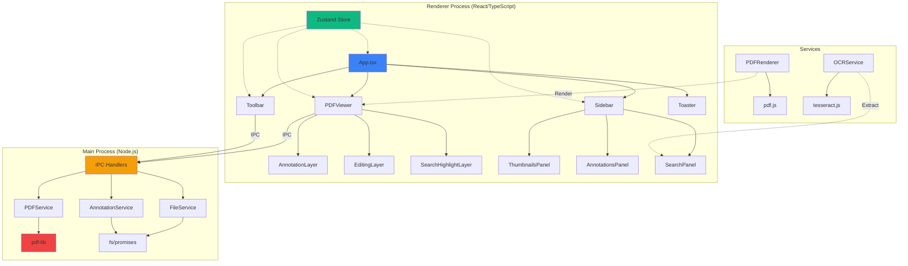
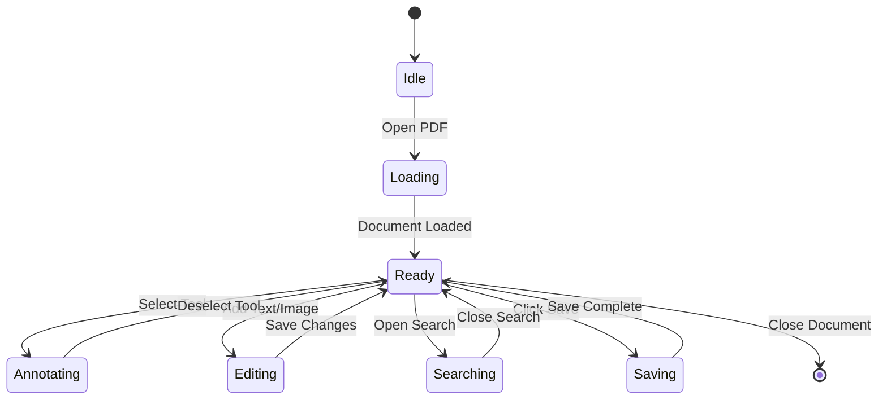

# 📄 Portable Document Formatter

> A modern, production-ready Electron desktop application for comprehensive PDF manipulation and editing.

[](https://www.electronjs.org/)
[](https://reactjs.org/)
[](https://www.typescriptlang.org/)
[](LICENSE)

## ✨ Features

### 📖 PDF Viewing
- **High-DPI Rendering** - Crisp text rendering on Retina/4K displays
- **Smooth Zoom** - 50% to 300% with quality preservation
- **Page Navigation** - Thumbnail sidebar, keyboard shortcuts
- **Dark Mode** - Eye-friendly theme with persistent preference

### ✏️ Annotations
- **Highlight, Underline, Strikethrough**
- **Shapes** - Rectangles, circles, freehand drawing
- **Comments** - Add notes to annotations
- **Edit & Delete** - Full management with undo support

### 🎨 PDF Editing
- **Add Text** - Custom fonts, sizes, and colors
- **Insert Images** - PNG/JPEG support with positioning
- **Visual Feedback** - Real-time overlay rendering
- **Persistent Changes** - All modifications embedded in saved PDF

### 🔍 Search & OCR
- **Full-Text Search** - With visual highlighting on PDF
- **OCR** - Extract text from scanned PDFs (Tesseract.js)
- **Multi-page OCR** - Process entire documents
- **Copy Results** - Export extracted text

### 📑 Page Management
- **Merge PDFs** - Combine multiple documents
- **Split PDF** - Extract specific page ranges
- **Reorder Pages** - Drag-and-drop interface
- **Delete/Extract** - Individual page operations

### 💾 Save & Export
- **Smart Save** - Embeds all modifications (text, images, annotations)
- **Selective Export** - Save specific pages (e.g., "1-3, 5, 7-9")
- **Original Preservation** - Non-destructive editing workflow

---

## 🚀 Quick Start

```bash
# Install dependencies
npm install

# Start development server
npm run dev

# Build for production
npm run build
```

### Usage

1. **Open PDF**: Click "Open PDF" button or File → Open
2. **Add Text**: Click T icon → Click on PDF → Enter text → Customize → Add
3. **Insert Image**: Click Image icon → Click on PDF → Select file → Insert
4. **Annotate**: Click Highlighter → Drag over text
5. **Search**: Click Search icon → Enter query → Navigate results
6. **Save**: Click Save → Choose pages → Select location → Save

---

## 🏗️ Architecture



### State Management



See [ARCHITECTURE.md](./ARCHITECTURE.md) for detailed technical documentation.

---

## 🛠️ Tech Stack

| Category | Technology |
|----------|-----------|
| **Framework** | Electron 28 |
| **UI Library** | React 18 + TypeScript 5 |
| **State Management** | Zustand |
| **Styling** | TailwindCSS + shadcn/ui |
| **PDF Rendering** | pdf.js |
| **PDF Manipulation** | pdf-lib |
| **OCR** | tesseract.js |
| **Build Tool** | Vite |
| **Testing** | Vitest + Playwright |

---

## 📦 Project Structure

```
portable-document-formatter/
├── src/
│   ├── main/                  # Electron main process
│   │   ├── main.ts           # Entry point + IPC handlers
│   │   ├── preload.ts        # Context bridge
│   │   └── services/         # Backend services
│   │       ├── pdf-service.ts
│   │       ├── file-service.ts
│   │       └── annotation-service.ts
│   ├── renderer/             # React app
│   │   ├── components/
│   │   │   ├── common/       # Toolbar, Sidebar
│   │   │   ├── features/     # Feature modules
│   │   │   └── ui/           # shadcn/ui components
│   │   ├── store/           # Zustand state
│   │   ├── hooks/           # Custom React hooks
│   │   └── styles/          # Global CSS
│   ├── services/            # Shared services
│   │   ├── pdf-renderer.ts  # pdf.js wrapper
│   │   └── ocr-service.ts   # Tesseract wrapper
│   └── types/               # TypeScript types
├── dist/                    # Build output
├── public/                  # Static assets
└── tests/                   # Test suites
```

---

## 🧪 Testing

```bash
# Run all tests
npm test

# Watch mode
npm run test:watch

# Coverage report (target: 70%+)
npm run test:coverage

# E2E tests
npx playwright test
```

---

## 🎨 UI Features

### Toast Notifications
Replaced all `alert()` dialogs with elegant toast notifications:
- **Success toasts** (green) for completed operations
- **Error toasts** (red) for failures
- **Info toasts** (blue) for general messages
- Auto-dismiss after 5 seconds

### Loading States
- **Spinner animations** during operations
- **Progress bars** for OCR processing
- **Overlay** for long-running tasks

### Smooth Transitions
- **Sidebar** - 300ms slide animation
- **Dark mode** - Instant theme switching
- **Zoom** - Smooth scaling

---

## ⚡ Performance

- **Lazy Loading**: Pages loaded on-demand
- **Worker Threads**: OCR runs in background
- **Optimized Rendering**: devicePixelRatio support
- **Memory Management**: PDF cleanup on close

---

## 🐛 Known Issues & Limitations

1. **Save Feature**: Requires dev server restart after main process changes
2. **Image Formats**: Only PNG/JPEG (SVG planned)
3. **Fonts**: Currently Helvetica only (more fonts coming)
4. **Large PDFs**: 100+ pages may take 10-15s to load thumbnails

---

## 📚 Documentation

- **[ARCHITECTURE.md](./ARCHITECTURE.md)** - Technical deep-dive with diagrams
- **[QUICKSTART.md](./QUICKSTART.md)** - Beginner's guide (archived)
- **[TROUBLESHOOTING.md](./TROUBLESHOOTING.md)** - Common issues (archived)

---

## 🤝 Contributing

1. Fork the repository
2. Create feature branch (`git checkout -b feature/AmazingFeature`)
3. Commit changes (`git commit -m 'Add AmazingFeature'`)
4. Push to branch (`git push origin feature/AmazingFeature`)
5. Open Pull Request

---

## 📄 License

This project is licensed under the MIT License - see the [LICENSE](LICENSE) file for details.

---

## 🙏 Acknowledgments

- **pdf.js** - Mozilla's PDF rendering engine
- **pdf-lib** - PDF manipulation library
- **tesseract.js** - OCR capabilities
- **shadcn/ui** - Beautiful component library
- **Radix UI** - Accessible primitives

---

## 📞 Support

- 🐛 **Bug Reports**: [GitHub Issues](https://github.com/yourusername/portable-document-formatter/issues)
- 💡 **Feature Requests**: [Discussions](https://github.com/yourusername/portable-document-formatter/discussions)
- 📧 **Email**: support@example.com

---

Made with ❤️ using Electron, React, and TypeScript
