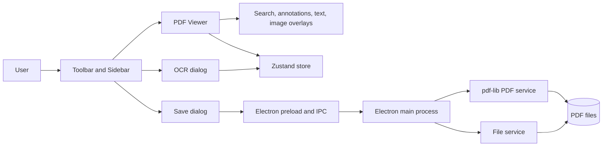

# Portable Document Formatter

Portable Document Formatter is an Electron desktop app for viewing, annotating, searching, OCR-processing, and saving edited PDF documents from a React and TypeScript UI.



See [ARCHITECTURE.md](/Users/supravojana/Documents/GitHub/portable-document-formatter/ARCHITECTURE.md) for the technical breakdown.

## What It Does

- Open local PDF files through an Electron file picker.
- Render pages with `pdfjs-dist`, including zoom, page navigation, thumbnails, and dark-mode UI.
- Add highlight annotations in the viewer and manage annotation comments from the sidebar.
- Add text and image overlays in the renderer and embed them into exported PDFs with `pdf-lib`.
- Search PDF text and highlight matches on the active page.
- Run OCR with `tesseract.js` on the current page or across all pages.
- Save the full document or selected page ranges while carrying over overlays and annotations.

## Current Status

Implemented and wired in the UI:

- PDF open, render, zoom, and navigation
- Thumbnail sidebar
- Search sidebar and result highlighting
- Highlight annotations plus annotation comment editing
- Text insertion
- Image insertion
- OCR dialog
- Save dialog with page-range selection and embedded modifications
- Theme toggle

Present in code but not fully productized:

- Page-management operations exist in the main process and a `PageManagement` dialog component exists, but it is not integrated into the main toolbar flow.
- `exportToImage` and `extractText` IPC endpoints are stubbed and currently throw.

## Quick Start

### Prerequisites

- Node.js 18+
- npm 9+

### Install

```bash
npm install
```

### Run in Development

```bash
npm run dev
```

This starts Vite, builds the Electron main process, waits for the renderer to come up on `http://localhost:5173`, and then launches Electron.

### Build

```bash
npm run build
```

### Build A macOS DMG

```bash
npm run dist:mac
```

This writes a universal macOS installer DMG to `release/Portable Document Formatter-<version>-universal.dmg`.

For a signed build using your Apple Developer credentials:

```bash
npm run dist:mac:signed
```

### Build A Windows EXE

```bash
npm run dist:win
```

This writes a Windows NSIS installer EXE to `release/Portable Document Formatter-Setup-<version>.exe`.

If you want a signed Windows installer, use the same command pattern after configuring your Windows code-signing certificate:

```bash
npm run dist:win:signed
```

### Test

```bash
npm test
npm run test:e2e
```

## Common Workflows

### Open and Review a PDF

1. Click the folder button in the toolbar.
2. Choose a `.pdf` file.
3. Use the sidebar thumbnails, page arrows, and zoom controls to navigate.

### Add Text or Images

1. Open a PDF.
2. Click the text or image tool in the toolbar.
3. Click on the page to place the element.
4. Save the document to embed those edits into a new PDF.

### Search

1. Click the search button in the toolbar.
2. Enter a query in the sidebar.
3. Navigate through matches from the sidebar or result controls.

### OCR

1. Open a PDF.
2. Click the OCR button.
3. Choose current page or all pages.
4. Run OCR and copy the extracted text from the dialog.

### Save

1. Click save in the toolbar.
2. Save all pages or enter page ranges like `1-3, 5, 7-9`.
3. Choose an output path.
4. The app writes a new PDF with text, images, and supported annotations applied.

## Project Layout

```text
src/
  main/        Electron main process, IPC registration, file/PDF services
  renderer/    React app, feature components, UI primitives, Zustand store
  services/    Shared renderer-side services such as pdf.js and annotations
  tests/       Vitest setup and unit/UI tests
  e2e/         Playwright coverage
  workers/     OCR worker placeholder
```

## Troubleshooting

### PDF opens but does not render

- Restart `npm run dev` so the Electron main process rebuilds cleanly.
- Check that the selected file is a valid PDF.
- The renderer converts Electron `Buffer` data to `ArrayBuffer` before loading the document; if rendering regresses, inspect [src/renderer/components/features/viewer/PDFViewer.tsx](/Users/supravojana/Documents/GitHub/portable-document-formatter/src/renderer/components/features/viewer/PDFViewer.tsx).

### Saved PDF is missing edits

- Use the toolbar save action rather than copying the original file manually.
- Embedded save behavior is handled through `pdf:applyModifications` in [src/main/main.ts](/Users/supravojana/Documents/GitHub/portable-document-formatter/src/main/main.ts) and [src/main/services/pdf-service.ts](/Users/supravojana/Documents/GitHub/portable-document-formatter/src/main/services/pdf-service.ts).

### OCR is slow

- Multi-page OCR is sequential by design.
- Expect several seconds per page on larger or image-heavy documents.

### DMG opens with a macOS warning on another computer

- The default `npm run dist:mac` build is ad-hoc signed so it can be packaged without Apple certificates.
- On another Mac, the user may need to right-click the app and choose `Open` the first time.
- For smoother distribution without Gatekeeper warnings, use `npm run dist:mac:signed` with Developer ID signing and notarization credentials configured.

### EXE shows a Windows SmartScreen warning

- The default `npm run dist:win` build is unsigned.
- Windows may show a SmartScreen prompt on another computer until the installer is code signed.
- For smoother distribution, configure a Windows signing certificate before using the signed build flow.

## Notes From The Consolidated Docs

The removed Markdown files mostly covered three themes that are now merged here and in the architecture guide:

- setup and quick-start instructions
- bug-fix history around PDF loading, save embedding, search, annotation editing, and OCR
- troubleshooting and implementation notes for the renderer/main-process boundary
