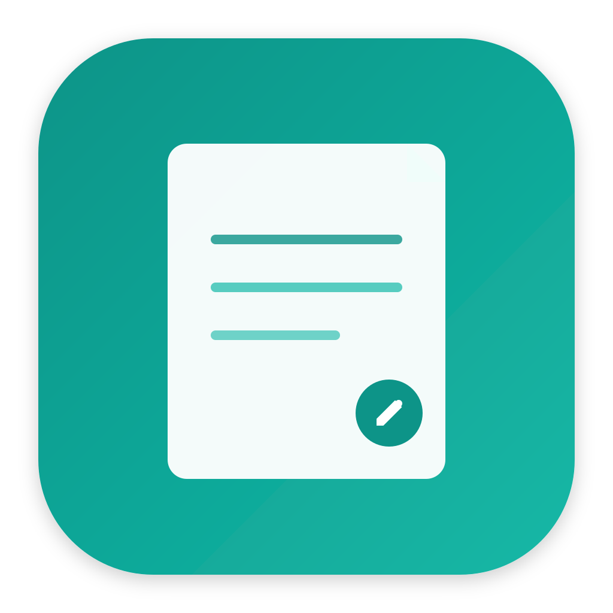
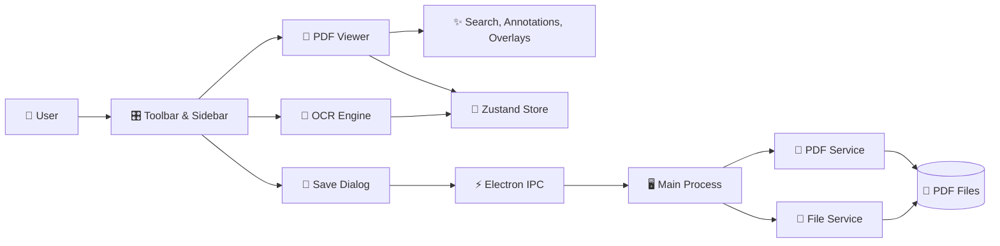

<div align="center">
  

  # Portable Document Formatter

  ### 🚀 A Modern, Feature-Rich PDF Editor Built with Electron

  **View • Annotate • Edit • OCR • Export** — All in one beautiful desktop app

  [](https://opensource.org/licenses/MIT)
  [](https://www.electronjs.org/)
  [](https://reactjs.org/)
  [](https://www.typescriptlang.org/)
  [](http://makeapullrequest.com)

  [Features](#-features) • [Installation](#-installation) • [Usage](#-usage) • [Tech Stack](#-tech-stack) • [Contributing](#-contributing)

</div>

---

## ✨ Features

### 📄 **Advanced PDF Viewing**
- 🔍 **Zoom & Navigation** — Smooth zooming with intuitive page controls
- 🖼️ **Thumbnail Sidebar** — Quick navigation with visual page previews
- 🌓 **Dark Mode** — Easy on the eyes with beautiful dark theme support
- ⚡ **Fast Rendering** — Powered by PDF.js for lightning-fast page rendering

### ✏️ **Powerful Editing Tools**
- 🎨 **Highlight Annotations** — Mark important sections with customizable highlights
- 💬 **Comment System** — Add notes and comments to your annotations
- 📝 **Text Overlays** — Insert custom text directly onto PDF pages
- 🖼️ **Image Insertion** — Add images and graphics to your documents
- 📊 **Non-Destructive Editing** — Original PDFs remain untouched until you save

### 🔎 **Smart Search & Extraction**
- 🔍 **Full-Text Search** — Find any text across your entire document
- 📍 **Result Highlighting** — Visual highlights for all search matches
- 🤖 **Multi-Format Extraction** — Extract structured Markdown from PDF, Office docs, and images
- 🚀 **High-Performance Backend** — Powered by Microsoft MarkItDown via FastAPI microservice
- 💾 **Result Caching** — Near-instant access to previously processed documents via IndexedDB

### 💾 **Flexible Export Options**
- 📑 **Selective Export** — Save specific page ranges (e.g., "1-3, 5, 7-9")
- ✅ **Embed Modifications** — All edits are permanently embedded in exported PDFs
- 🔒 **Preserve Quality** — No loss of quality during save operations
- 📤 **Multiple Formats** — Export with all annotations and overlays intact

---

## 📸 Screenshots

<div align="center">
  
  <p><em>Clean, intuitive interface with powerful editing tools</em></p>
</div>

> **Note:** Add screenshots of your app in action by placing them in the `public/screenshots/` folder!

---

## 🚀 Installation

### Download Pre-built Binaries

**macOS** (Universal - Intel & Apple Silicon)
```bash
# Download from releases page
# Or build locally:
npm run dist:mac
```

**Windows** (64-bit)
```bash
# Download from releases page
# Or build locally:
npm run dist:win
```

### Build from Source

#### Prerequisites
- Node.js 18+ ([Download](https://nodejs.org/))
- npm 9+
- Git

#### Quick Start

```bash
# Clone the repository
git clone https://github.com/yourusername/portable-document-formatter.git
cd portable-document-formatter

# Install dependencies
npm install

# Run in development mode
npm run dev

# Build for production
npm run build
```

---

## 📖 Usage

### 🔓 Opening PDFs
1. Click the **folder icon** in the toolbar
2. Select any PDF file from your computer
3. Start viewing and editing immediately

### ✏️ Adding Annotations
1. **Highlight Text**: Select the highlight tool and click-drag on text
2. **Add Comments**: Click on any highlight to add or edit comments
3. **Insert Text**: Choose the text tool and click anywhere on the page
4. **Add Images**: Click the image tool, select an image, and place it

### 🔍 Searching Documents
1. Click the **search icon** in the toolbar
2. Type your search query
3. Navigate through results with keyboard shortcuts or the sidebar

### 🤖 Document Extraction (OCR & Multi-Format)
1. Open any document or image (.pdf, .docx, .pptx, .xlsx, .png, .jpg)
2. Click the **Extraction** button in the toolbar
3. The system will automatically detect the format and select the best extraction strategy
4. Preview the structured Markdown results and copy/export as needed
5. Frequent documents are cached for near-instant access!

### 💾 Saving Your Work
1. Click the **save button** in the toolbar
2. Choose to save all pages or specify ranges (e.g., `1-5, 8, 10-12`)
3. Select output location
4. Your new PDF will include all edits and annotations!

---

## 🛠️ Tech Stack

Built with modern, production-ready technologies:

| Technology | Purpose |
|------------|---------|
| ⚡ **Electron 28** | Cross-platform desktop framework |
| ⚛️ **React 18** | UI library with hooks |
| 📘 **TypeScript** | Type-safe development |
| 🎨 **Tailwind CSS** | Utility-first styling |
| 🧩 **Radix UI** | Accessible component primitives |
| 📄 **PDF.js** | PDF rendering engine |
| 📝 **pdf-lib** | PDF manipulation and creation |
| 🤖 **MarkItDown** | Primary multi-format extraction engine |
| ⚡ **FastAPI** | Python microservice for document processing |
| 📦 **Dexie.js** | IndexedDB wrapper for result caching |
| 🤖 **Tesseract.js** | Fallback OCR for local image processing |
| 🐻 **Zustand** | Lightweight state management |
| ⚡ **Vite** | Lightning-fast build tool |
| 🧪 **Vitest** | Modern testing framework |
| 🎭 **Playwright** | End-to-end testing |

---

## 🏗️ Architecture



📚 **Detailed Architecture**: See [ARCHITECTURE.md](ARCHITECTURE.md) for in-depth technical documentation.

---

## 🗂️ Project Structure

```
portable-document-formatter/
├── 📂 src/
│   ├── 🖥️ main/              # Electron main process
│   │   ├── main.ts           # Entry point & IPC handlers
│   │   └── services/         # PDF and file services
│   ├── ⚛️ renderer/          # React application
│   │   ├── components/       # UI components
│   │   ├── store/            # Zustand state management
│   │   └── types/            # TypeScript definitions
│   ├── 🧪 tests/             # Vitest unit tests
│   ├── 🎭 e2e/               # Playwright E2E tests
│   └── 👷 workers/           # Web workers (OCR)
├── 📂 public/                # Static assets
├── 📂 dist/                  # Build output
└── 📂 release/               # Distribution packages
```

---

## 🗺️ Roadmap

### 🚧 In Progress (Phase 1: Foundation & Migration)
- [x] Multi-format extraction (PDF, DOCX, PPTX, XLSX) via Microsoft MarkItDown
- [x] FastAPI microservice integration
- [x] Strategy Pattern for pluggable document processors
- [x] Persistent result caching with IndexedDB (Dexie.js)
- [ ] Final GA sign-off and stability testing

### 🗺️ Future Roadmap
- [ ] LLM-assisted document analysis (Phase 2)
- [ ] Page management (reorder, delete, rotate)
- [ ] Export to images (PNG/JPEG)
- [ ] Enhanced annotation tools (shapes, arrows)

### 🔮 Future Plans
- [ ] Cloud storage integration (Google Drive, Dropbox)
- [ ] Real-time collaboration
- [ ] Form filling capabilities
- [ ] Digital signatures
- [ ] PDF merge/split
- [ ] Batch processing
- [ ] Plugin system
- [ ] Linux builds

---

## 🤝 Contributing

We welcome contributions from the community! Here's how you can help:

### Ways to Contribute
- 🐛 **Report Bugs**: Open an issue describing the problem
- ✨ **Suggest Features**: Share your ideas for new features
- 📝 **Improve Documentation**: Help make our docs better
- 💻 **Submit Pull Requests**: Fix bugs or implement features

### Development Workflow

```bash
# Fork and clone the repo
git clone https://github.com/yourusername/portable-document-formatter.git

# Create a feature branch
git checkout -b feature/amazing-feature

# Make your changes and test
npm run dev
npm test
npm run test:e2e

# Commit with a descriptive message
git commit -m "Add amazing feature"

# Push to your fork
git push origin feature/amazing-feature

# Open a Pull Request
```

### Code Style
- Use TypeScript for type safety
- Follow existing code formatting (Prettier)
- Write tests for new features
- Update documentation as needed

---

## 🧪 Testing

```bash
# Run unit tests
npm test

# Run tests in watch mode
npm run test:watch

# Run E2E tests
npm run test:e2e

# Generate coverage report
npm run test:coverage
```

---

## 📦 Building

### Development Build
```bash
npm run build
```

### Production Builds

**macOS (Universal)**
```bash
# Unsigned (for development)
npm run dist:mac

# Signed (requires Apple Developer credentials)
npm run dist:mac:signed
```

**Windows (64-bit)**
```bash
# Unsigned
npm run dist:win

# Signed (requires code signing certificate)
npm run dist:win:signed
```

Output files will be in the `release/` directory.

---

## 🐛 Troubleshooting

### PDF doesn't render
- Ensure the file is a valid PDF
- Try restarting the app in development mode: `npm run dev`
- Check the console for error messages

### Saved PDF is missing edits
- Always use the **Save** button in the toolbar
- Don't manually copy the original file
- Edits are only embedded when saving through the app

### OCR is slow
- OCR processing can take several seconds per page
- For faster results, process only the current page
- Image quality affects OCR speed and accuracy

### macOS Gatekeeper warning
- Right-click the app and choose **Open** the first time
- For production use, build with `npm run dist:mac:signed`

### Windows SmartScreen warning
- Click "More info" then "Run anyway"
- For production use, code-sign with `npm run dist:win:signed`

---

## 📄 License

This project is licensed under the **MIT License** - see the [LICENSE](LICENSE) file for details.

```
MIT License - You are free to use, modify, and distribute this software.
```

---

## 🌟 Show Your Support

If you find this project useful, please consider:

- ⭐ **Starring the repository**
- 🐛 **Reporting bugs or suggesting features**
- 📢 **Sharing with others who might benefit**
- 🤝 **Contributing code or documentation**

---

## 📞 Contact & Support

- 📧 **Email**: your.email@example.com
- 🐦 **Twitter**: [@yourhandle](https://twitter.com/yourhandle)
- 💬 **Discussions**: [GitHub Discussions](https://github.com/yourusername/portable-document-formatter/discussions)
- 🐛 **Issues**: [GitHub Issues](https://github.com/yourusername/portable-document-formatter/issues)

---

## 🙏 Acknowledgments

Built with amazing open-source projects:
- [Electron](https://www.electronjs.org/) - Desktop app framework
- [React](https://reactjs.org/) - UI library
- [PDF.js](https://mozilla.github.io/pdf.js/) - PDF rendering by Mozilla
- [pdf-lib](https://pdf-lib.js.org/) - PDF manipulation
- [MarkItDown](https://github.com/microsoft/markitdown) - Primary multi-format extraction engine
- [Tesseract.js](https://tesseract.projectnaptha.com/) - Fallback OCR engine
- [Radix UI](https://www.radix-ui.com/) - Accessible components
- [Tailwind CSS](https://tailwindcss.com/) - Utility-first CSS

---

<div align="center">

  **Made with ❤️ by developers, for developers**

  [⬆ Back to Top](#portable-document-formatter)

</div>
